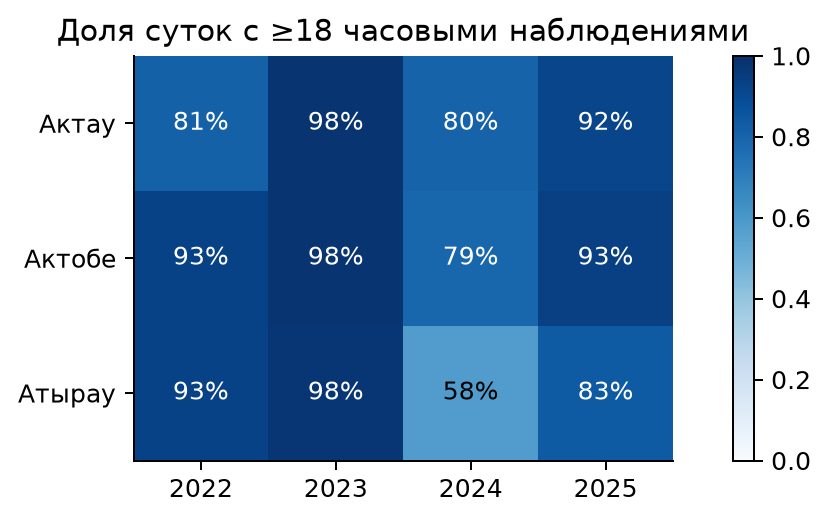
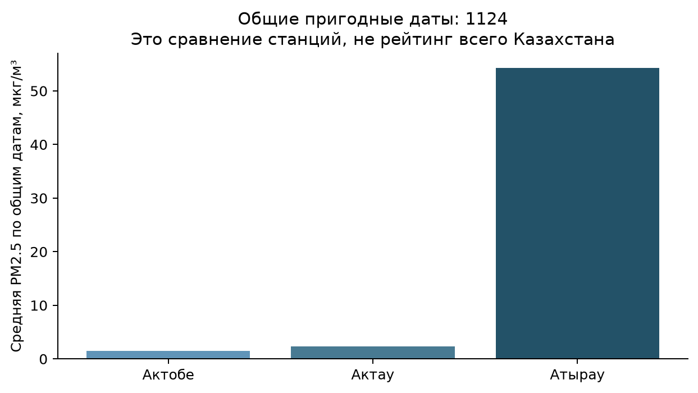
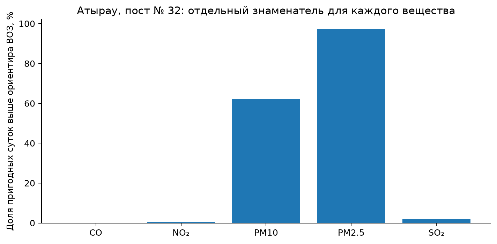
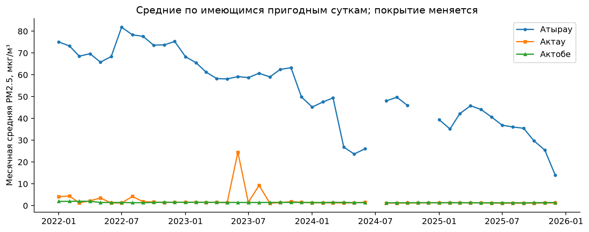
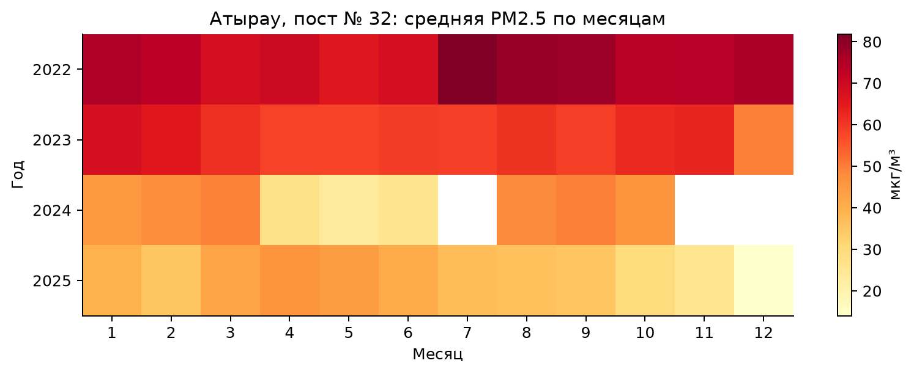
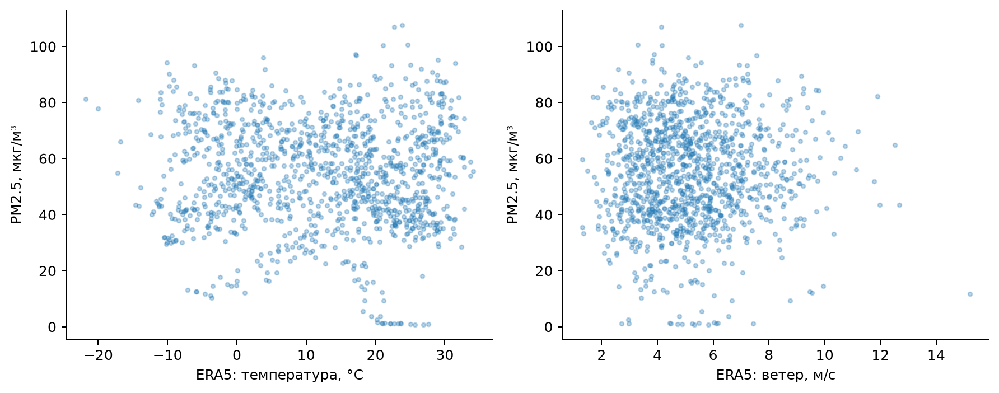
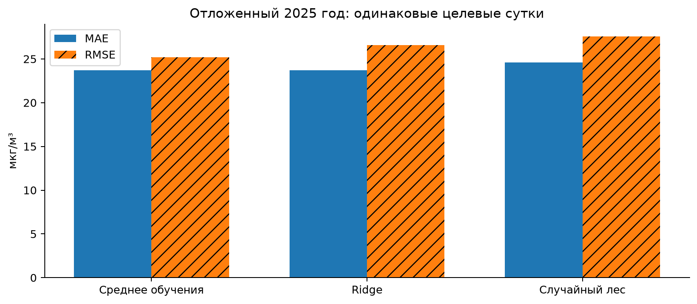

# Анализ архивных показаний качества воздуха в Атырау, Актау и Актобе

Исходный кейс №1. Assessment and Analysis of Air Pollution Levels in Major Cities of Kazakhstan.

Курс: Artificial intelligence and machine learning. Assignment 1. Период анализа: 2022–2025. Статус: PARTIAL — вычислительное исследование завершено; экологическая интерпретация ограничена неразрешённой проверкой измерительных каналов.

## Аннотация

Исследование сопоставляет фиксированные пункты наблюдений трёх городов западного Казахстана и проверяет, насколько метеорологические условия объясняют архивный показатель PM2.5. На 1124 общих пригодных датах средняя опубликованная PM2.5 на посту № 32 в Атырау составляет 54.298 мкг/м³. Это наибольшее значение среди выбранных станций, но не доказанный рейтинг загрязнения городов: PM2.5 превышает парную PM10 в 845 из 1209 суток. Дополнительный временной ML-эксперимент не показывает устойчивого выигрыша над простым средним. Его MAE на 304 сутках итоговой проверки равна 23.708 мкг/м³. Приоритетная рекомендация — восстановить проверяемую метрологическую цепочку, затем оценивать меры снижения воздействия. Все результаты рассчитаны по сохранённым CSV. Исходное вычисление: 25.09.2026; повторный научный аудит и редакция: 26.09.2026. Использованы реальные опубликованные измерительные записи, а не синтетические данные. Однако принадлежность записи архиву не подтверждает исправность канала: нужна независимая проверка калибровки. Работа выполнена с раскрываемой ИИ-помощью; авторские реквизиты студента не установлены и не выдуманы.

## 1. Проблема и исследовательские вопросы

В локальном экологическом анализе важно различать измеренную концентрацию, индекс качества воздуха и оценку воздействия на население. Здесь объект — суточное показание конкретной станции. Городская экспозиция, доли источников и медицинские исходы не наблюдаются. Поэтому работа отвечает на пять вопросов Task 1 на уровне доступного доказательства: какая выбранная станция имеет более высокие архивные показания; какие вещества чаще превышают сопоставимые ориентиры; что известно об источниках из литературы; меняются ли показания по сезонам; какие действия реалистичны в ближайшие 5–10 лет.

Атырау — основной объект. Актау и Актобе добавлены из того же национального архива для единого происхождения и частоты. В каждом городе фиксируется один пункт, чтобы меняющийся состав сети не создавал ложный тренд. Такой дизайн улучшает временную сопоставимость и одновременно ограничивает пространственную: один пост не представляет все жилые районы. Число постов, отсутствующие параметры и различия полноты рассматриваются как часть результата, а не скрываются.

## 2. Обзор первоисточников

Казгидромет описывает наблюдения в промышленной зоне Атырау и перечень контролируемых примесей [3]. Это подтверждает существование мониторинга, но не является доказательством доступности длинного почасового архива. Для эмпирического анализа выбран открытый архив AirData.kz, который публикует значения с исходными единицами и документацией очистки [1, 2]. Бюро национальной статистики публикует годовые индикаторы [4]; они подходят для широкого контекста, но не заменяют суточные записи.

Исследование Yessenamanova и соавторов использовало мониторинг H₂S в Атырау за ограниченный период 2020 года [10]. Его пространственная неоднородность обосновывает необходимость нескольких станций. При этом заключение статьи прямо признаёт неопределённость источника отдельных выбросов; переносить результат на наши годы или рассчитывать долю АНПЗ по корреляции нельзя. Региональная инвентаризация за 2018–2022 годы отдельно рассматривает стационарные источники, автотранспорт и отопление [9]. Это основание обсуждать соответствующие направления политики, но областной инвентаризационный объём выбросов не равен концентрации в точке.

ВОЗ 2021 задаёт ориентиры концентраций и времени усреднения [5, 6]. Они не являются юридически обязательными стандартами. Национальный приказ № ҚР ДСМ-70 содержит отдельные среднесуточные и максимально разовые ПДК [7]. В работе выполняется описательное сопоставление с текущей прочитанной редакцией; ретроспективная квалификация правонарушений не проводится.

Сопоставление этих источников определяет дизайн исследования. Инвентаризация описывает массу выбросов и категории объектов, станционные ряды — концентрацию после переноса и рассеивания, а рекомендации ВОЗ — ориентиры воздействия. Эти три уровня нельзя подменять друг другом. Поэтому здесь не рассчитываются проценты вклада завода и транспорта: для них потребовались бы совместимые сведения о выбросах, химическом составе и переносе примесей. Исследование H₂S в Атырау охватывало 32 дня с сентября по октябрь 2020 года и восемь пунктов [10]; оно полезно как пример пространственного дизайна, но не подтверждает сезонность PM2.5 в 2022–2025 годах.

Пробел, который закрывает настоящая работа, — проверяемое соединение архивных записей, полноты и простых моделей в одной локальной задаче. При этом документация набора [2] описывает ретроспективные фильтры, а не протокол поверки каждого датчика. Поэтому воспроизводимость вычислений рассматривается отдельно от экологической достоверности. Отрицательный результат модели и обнаруженное противоречие каналов имеют самостоятельное исследовательское значение: они указывают, какие доказательства нужны до содержательной интерпретации показаний.

## 3. Происхождение и проверка данных

Зафиксирован commit AirData.kz 0fe9a615baf614346e282796f685ce72b852187f. Для семи загрязнителей получены полные gzip-архивы; SHA-256 и URL сохранены в results/download_manifest.csv. Исходное наблюдение — запись станции за час. После фильтрации трёх городов, периода и проверки конечности значений сохранено 1054818 записей по всем доступным станциям и веществам. Значения mg/m³ проверены против value_ugm3=raw_value×1000. Собственная проверка не выявила несовпадений пересчёта, отрицательных значений или дубликатов station_id–time; это ожидаемо для уже очищенного поставщиком архива и не означает, что приборы исправны.

Пост № 32 в Атырау обозначен PCP #8 и имеет координаты 47.096617, 51.942701. Сравниваемые станции — Актау, пост № 22 и Актобе, пост № 31. Строки времени содержат явные смещения −07/−08 несмотря на название datetime_utc: код сохраняет абсолютный момент по указанному offset, затем переводит в Asia/Atyrau (UTC+5). Смысл этих исходных смещений нуждается в подтверждении поставщика. Исходные строки не переписываются под желаемую локальную дату.

Погода получена отдельно из ERA5 через Open-Meteo для точки Атырау, пост № 32: температура, относительная влажность, ветер и осадки [8]. Это пространственный реанализ, а не датчик на станции. Он используется только в одновременной объяснительной задаче; здесь не делается предположение о доступности реанализа в реальном времени.

Таблица 1. Полнота суточной PM2.5 Атырау, пост № 32. Условие пригодности — минимум 18 уникальных часов из 24.

| Год | Пригодные сутки | Календарные сутки | Полнота |
| --- | --- | --- | --- |
| 2022 | 338 | 365 | 92.6% |
| 2023 | 356 | 365 | 97.5% |
| 2024 | 211 | 366 | 57.7% |
| 2025 | 304 | 365 | 83.3% |

Из 1461 календарных суток Атырау пригодны 1209; 252 отсутствуют или неполны. Особенно разрежен 2024 год. Пропуски не превращены в нули и не заполнены для оценки. Фильтр 18 часов — аналитическое правило полноты, а не утверждение о выполнении всех требований государственного мониторинга.

## 4. Методология и контроль качества

Для каждой пары станция–вещество рассчитана средняя доступных часов суток; при недостатке часов целевая величина остаётся пропущенной. Межгородское сравнение PM2.5 ограничено пересечением пригодных дат. Анализ каждого вещества использует собственный явно указанный знаменатель. Рассчитываются распределения, месячные средние, сезонные таблицы и ранговая корреляция Spearman с погодой. Графики не соединяют искусственно восстановленные целевые метки.

Критическая дополнительная проверка сопоставляет вложенные фракции частиц. На посту № 32 в Атырау PM2.5 больше PM10 в 845 из 1209 парных суток (69.9%); в 280 случаях разница превышает 20%. Неодинаковые приборы и ошибки измерений могут давать отдельные несоответствия, однако столь частое расхождение требует проверки маркировки каналов, единиц и калибровки. На посту № 31 в Актобе отмечена необычно малая вариативность PM2.5. Значения не исправлены произвольным коэффициентом, а дни не исключены ради красивого рейтинга.

Объяснительная модель оценивает PM2.5 того же дня по ERA5 и циклическому календарю. Обучение — 2022–2023, валидация — 2024, итоговая проверка — 2025. Ridge выбирается из alpha=0.1,1,10; Random Forest — 200 деревьев, глубина 8, минимальный лист 3 или 10. Критерий выбора — MAE на валидации. Медиана для заполнения признаков и StandardScaler обучаются только на обучающей части. После выбора выполняется повторное обучение на обучающей и валидационной частях. Простое среднее обучающего периода является обязательным контрольным ориентиром. Все метрики итоговой проверки рассчитываются по одним датам. Это не прогноз будущего — для него выделен отдельный кейс №10.

## 5. Результаты: сравнение станций и веществ

Таблица 2. PM2.5 на общих пригодных датах. Среднее и медиана — мкг/м³. Последние столбцы показывают число и долю суток выше суточного ориентира ВОЗ 15 мкг/м³.

| Город | Сутки | Среднее | Медиана | Выше 15: сутки | Выше 15: % |
| --- | --- | --- | --- | --- | --- |
| Актау | 1124 | 2.359 | 1.253 | 13 | 1.157 |
| Актобе | 1124 | 1.459 | 1.449 | 0 | 0.000 |
| Атырау | 1124 | 54.298 | 54.507 | 1093 | 97.242 |

Ответ на вопрос о наиболее загрязнённом городе ограничен: в скачанном архиве выше показатель Атырау, пост № 32. На основании проверки фракций нельзя надёжно превратить это в вывод о наиболее загрязнённом городе Казахстана или даже реальном ранге экспозиции этих трёх городов. Отсутствие превышений на другом посту также не доказывает безопасность воздуха в городе.

Таблица 3. Атырау, пост № 32: суточные ориентиры ВОЗ и отдельные знаменатели по веществам.

| Вещество | Ориентир, мкг/м³ | Пригодные сутки | Выше: сутки | Выше: % |
| --- | --- | --- | --- | --- |
| CO | 4000.000 | 1208 | 0 | 0.000 |
| NO₂ | 25.000 | 1012 | 5 | 0.494 |
| PM10 | 45.000 | 1209 | 751 | 62.117 |
| PM2.5 | 15.000 | 1209 | 1176 | 97.270 |
| SO₂ | 40.000 | 529 | 11 | 2.079 |

Частоту превышения можно использовать для первичного отбора каналов на проверку. Нельзя ранжировать токсичность просто по числу микрограммов. Для H₂S и O₃ достаточного сопоставимого суточного ряда выбранного поста нет; суточный ВОЗ-порог для H₂S не выдуман, а восьмичасовой критерий O₃ не приложен к суточным средним. ВОЗ суточный уровень соответствует 99-му процентилю распределения; простая доля дней выше него — описательная статистика, не самостоятельная процедура сертификации соответствия.

Таблица 4. Сопоставление с национальными среднесуточными величинами из текущей прочитанной редакции № ҚР ДСМ-70. Единицы переведены из mg/m³ в мкг/м³; не используются максимально разовые значения.

| Вещество | Ориентир, мкг/м³ | Пригодные сутки | Выше: сутки | Выше: % |
| --- | --- | --- | --- | --- |
| CO | 3000.000 | 1208 | 0 | 0.000 |
| NO₂ | 40.000 | 1012 | 3 | 0.296 |
| PM10 | 60.000 | 1209 | 451 | 37.304 |
| PM2.5 | 35.000 | 1209 | 1054 | 87.179 |
| SO₂ | 50.000 | 529 | 7 | 1.323 |

## 6. Время, сезоны и метеоусловия

Таблица 5. Сезонные значения PM2.5 Атырау, пост № 32, мкг/м³; n — наблюдаемые пригодные сутки.

| Год | Сезон | Сутки | Среднее |
| --- | --- | --- | --- |
| 2022 | Весна | 88 | 67.987 |
| 2022 | Зима | 80 | 74.553 |
| 2022 | Лето | 83 | 76.688 |
| 2022 | Осень | 87 | 74.952 |
| 2023 | Весна | 87 | 59.183 |
| 2023 | Зима | 87 | 61.458 |
| 2023 | Лето | 92 | 59.546 |
| 2023 | Осень | 90 | 61.629 |
| 2024 | Весна | 92 | 33.369 |
| 2024 | Зима | 60 | 46.352 |
| 2024 | Лето | 21 | 39.670 |
| 2024 | Осень | 38 | 48.929 |
| 2025 | Весна | 91 | 43.993 |
| 2025 | Зима | 60 | 31.492 |
| 2025 | Лето | 92 | 37.831 |
| 2025 | Осень | 61 | 30.618 |

Единого устойчивого зимнего максимума во все годы эта таблица не подтверждает. Межгодовые уровни меняются, часть сезонных клеток имеет заметно меньше наблюдений. Поэтому разделение на календарные сезоны здесь описательное: полноценную сезонную декомпозицию с заполненными пробелами нельзя интерпретировать как наблюдаемую ежегодную закономерность. Наблюдаемый спад не приписывается конкретной экологической политике: могут влиять калибровка, изменение канала, отбор провайдером и пропуски.

Spearman(PM2.5, температура)=-0.033; с ветром — 0.028; с влажностью — 0.034. В текущей выборке это слабые монотонные связи. Нулевая агрегированная связь не исключает отдельных метеорологических эпизодов и тем более не доказывает отсутствие выбросов.

## 7. Реально обученный объяснительный эксперимент

Таблица 6. Отложенная проверка на данных 2025 года. MAE и RMSE — мкг/м³, R² безразмерен.

| Модель | MAE | RMSE | R² | Сутки |
| --- | --- | --- | --- | --- |
| Среднее обучения | 23.708 | 25.211 | -7.504 | 304 |
| Ridge | 23.707 | 26.561 | -8.439 | 304 |
| Случайный лес | 24.593 | 27.584 | -9.180 | 304 |

По валидации выбрано среднее обучающего периода. Незначительное различие MAE между Ridge и baseline на итоговой проверке не меняет заранее выбранную модель. Все R² отрицательны: ошибка существенно больше вариации целевой переменной вокруг среднего самого test. Сдвиг уровня между 2022–2023 и 2025 годами объясняет, почему простая экстраполяция обученного среднего особенно неудачна. Погода и календарь не обеспечили переносимость. Дополнительное блочное пересэмплирование парных ошибок даёт для разницы MAE Ridge минус среднее -0.002 мкг/м³ и приблизительный 95%-й диапазон [-1.680; 1.738] при блоке 14 суток. Столь малое различие нельзя считать устойчивым преимуществом. Методика и ограничения этой последующей проверки описаны в results/revision_analysis_metadata.json и [12]; модели не переобучались. Это отрицательный эмпирический результат, а не основание менять границы test.

Предсказания, остатки, результаты перестановки признаков, фактические параметры и веса сохранены. Перестановочная важность — чувствительность обученной модели; при слабой общей модели она не даёт доказательства причинного вклада погоды. Коррелированные погодные признаки дополнительно ограничивают её интерпретацию.

## 8. Источники, риски и рекомендации

Промышленность, энергетика, отопление и транспорт рассматриваются как документированные региональные направления [3, 9], а не количественно оценённые причины каждой точки графика. Диаграмма долей источников не построена: нет сопоставимой локальной инвентаризации массы выбросов, химического состава и модели переноса, позволяющей оценить эти доли. Последствия для здоровья обсуждаются только на уровне общего обоснования мониторинга ВОЗ. Число заболеваний, смертей или индивидуальный риск по этой выборке не рассчитывались.

В течение ближайшего года практический приоритет — аудит каналов № 32, 22 и 31, сопоставление с паспортами приборов и ручными/референсными пробами, публикация происхождения флагов качества и истории калибровки. Затем следует восстановить многопостовую сеть с гарантированной доступностью временных архивов и регистрировать время публикации записи. Для информации населению использовать официальные сообщения, а не этот экспериментальный прогноз.

На горизонте 1–3 лет полезны верификация инвентаризации выбросов, прицельные измерения рядом с промышленными и транспортными объектами, сезонные кампании H₂S и PM, документирование ремонтов и смены приборов. На 5–10 лет возможны модернизация очистки выбросов, повышение энергоэффективности и транспортные меры, но выбор и бюджет должны опираться на дополнительное исследование источников. Наблюдаемые различия архива не являются рассчитанной экономической выгодой какой-либо меры.

## Дополнительная проверка станции Атырау, пост № 235

Выявленная проблема не относится автоматически ко всей сети. У PCP #10 (ID 235) исходное сравнение суточных средних даёт один случай PM2.5 > PM10 из 1300; ниже показано, что при выравнивании часов он исчезает, у более коротких рядов 33 и 86 таких случаев в проверенном периоде нет. Это делает 235 разумным кандидатом для следующей независимой проверки, но само согласие фракций не удостоверяет калибровку. В дополнительном исследовательском эксперименте кейса №10 на 235 сохранены признаки, годы split и уже выбранные на 32 гиперпараметры; настройки по 235 не проводились. На 353 отложенных сутках persistence имеет MAE 2.928 мкг/м³. Основной заранее зафиксированный эксперимент 32 не заменён. Этот анализ добавлен после проверки качества, является дополнительным исследовательским и не устраняет ограничения времени публикации и ретроспективного QC. Подробная таблица находится в отчёте кейса №10 и results/sensitivity235.

### Дополнительная проверка 26.09.2026: одинаковые часы

Первоначальное сравнение суточных средних допускает, что PM2.5 и PM10 наблюдались в разные часы. При повторном аудите записи соединены по городу, посту и точному временному штампу; обе средние рассчитаны заново только по общим часам. В таблицу входят сутки с минимум 18 такими парами. Это последующая проверка устойчивости, а не изменение основной выборки или отбор удобных дней.

Таблица 7. Сравнение фракций Атырау после выравнивания часов.

| Пост | Парные сутки | PM2.5 > PM10: сутки | Разница >20%: сутки |
| --- | --- | --- | --- |
| 235 | 1300 | 0 | 0 |
| 32 | 1209 | 845 | 280 |

На посту № 32 остаются 845 несоответствий: различное часовое покрытие не объясняет основной сигнал. На посту № 235 прежний единственный случай исчезает: 0 из 1300 суток. Поэтому первоначальный показатель 1/1300 нельзя трактовать как подтверждённую аномалию этого поста. Небольшие межприборные различия сами по себе не доказывают ошибку; частота и расхождения более 20% на посту № 32 требуют проверки приборов.

Дополнительно правило полноты ужесточено с 18 до 24 часов без изменения исходных значений. На 1003 общих датах трёх постов среднее Атырау равно 53.917 мкг/м³. Порядок архивных средних сохраняется; метрологическое ограничение остаётся. Полная таблица сохранена в results/completeness_sensitivity.csv.

## 9. Ограничения и ответы на вопросы Task 1

Самое существенное ограничение — непроверенная физическая согласованность PM-каналов выбранного поста № 32. Дополнительно действуют выборочность станций, пропуски, неизвестное время фактической доступности записей и ретроспективная очистка AirData.kz. Процедуры соседних скачков и пространственных выбросов поставщика могут опираться на последующие наблюдения; этот архив нельзя безоговорочно считать доступным в исходном виде в прошлом.

RQ1: максимальный архивный показатель среди выбранных постов — Атырау, пост № 32; рейтинг городов не подтверждён. RQ2: таблица 3 показывает частоту превышений доступных веществ, но не полный перечень рисков. RQ3: литература указывает направления источников, их доли не установлены. RQ4: сезонные различия есть, устойчивый одинаковый зимний максимум не подтверждён. RQ5: сначала метрология и полнота, затем проверяемая оценка источников и мер. Каждая формулировка относится к фактически доступному доказательству.

## 10. Заключение и воспроизводимость

Создан проверяемый путь от опубликованных почасовых записей к суточным таблицам, графикам и реальному ML-эксперименту. Основное содержательное открытие — ограничение достоверности, которое обнаруживается при совместном анализе PM2.5 и PM10. Кейс имеет статус PARTIAL до получения метаданных каналов и независимой проверки калибровки. Код, веса и вычисления доступны для проверки, но это не заключение о санитарной безопасности.

Запуск из корня пакета: `python 01_Air_Pollution/pipeline.py --case 1`. Проверка сохранённых метрик: `python 01_Air_Pollution/pipeline.py --verify`. Отдельно выполненный Notebook воспроизводит расчёты из чистого kernel. Источники, хеши, quality_checks и limitations позволяют проверить происхождение каждого числа.

## Литература

1. AirData.kz / Global Shapers Almaty Hub. Open Air Quality Dataset for Kazakhstan. Kazakhstan; 2020–2026. URL: https://github.com/qazybekb/AirDatakz-OpenData (обращение: 25.09.2026).
2. AirData.kz. Datasheet for Dataset: AirData.kz Open Air Quality Data. Kazakhstan; 2017–2026. URL: https://github.com/qazybekb/AirDatakz-OpenData/blob/0fe9a615baf614346e282796f685ce72b852187f/DATASHEET.md (обращение: 25.09.2026).
3. РГП Казгидромет. Мониторинг промышленной зоны Атырау. Atyrau; 2021. URL: https://www.kazhydromet.kz/ru/post/1063 (обращение: 25.09.2026).
4. Bureau of National Statistics of Kazakhstan. 21.2.a Air quality. Kazakhstan; annual since 2014. URL: https://stat.gov.kz/en/open-data/pollution/482928/ (обращение: 25.09.2026).
5. World Health Organization. WHO global air quality guidelines. Global; 2021. URL: https://www.who.int/publications/i/item/9789240034228 (обращение: 25.09.2026).
6. World Health Organization. What are the WHO Air quality guidelines?. Global; 2021. URL: https://www.who.int/news-room/feature-stories/detail/what-are-the-who-air-quality-guidelines (обращение: 25.09.2026).
7. Министерство здравоохранения Республики Казахстан. Об утверждении Гигиенических нормативов к атмосферному воздуху. Kazakhstan; 2022, amended 2025. URL: https://old.adilet.zan.kz/rus/docs/V2200029011 (обращение: 25.09.2026).
8. Open-Meteo / Copernicus / ECMWF. Historical Weather API, ERA5. Atyrau ERA5 grid point; 2022–2025. URL: https://open-meteo.com/en/docs/historical-weather-api (обращение: 25.09.2026).
9. Гидрометеорология и экология. Инвентаризация источников загрязнения атмосферного воздуха Западно-Казахстанского региона. Western Kazakhstan four regions; 2018–2022. URL: https://journal.kazhydromet.kz/kazgidro/article/view/2341 (обращение: 25.09.2026).
10. M. Yessenamanova, Z. Yessenamanova, A. Tlepbergenova, G. Batyrbayeva. Analysis of the Content of Hydrogen Sulfide in the Air of the City of Atyrau. Atyrau; 2020 observations; published 2021. URL: https://www.iieta.org/journals/ijsdp/paper/10.18280/ijsdp.160308 (обращение: 25.09.2026).
11. scikit-learn developers. Lagged features for time series forecasting. Methodological; accessed 2026. URL: https://scikit-learn.org/stable/auto_examples/applications/plot_time_series_lagged_features.html (обращение: 25.09.2026).
12. Hans R. Künsch. The Jackknife and the Bootstrap for General Stationary Observations. Annals of Statistics 17(3), 1217–1241. Methodological; 1989. URL: https://doi.org/10.1214/aos/1176347265 (обращение: 26.09.2026).
