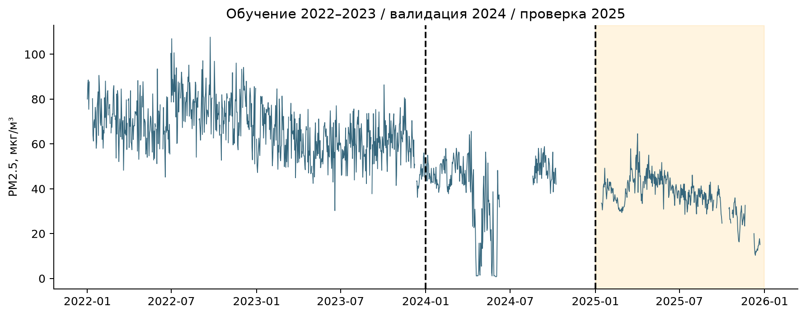
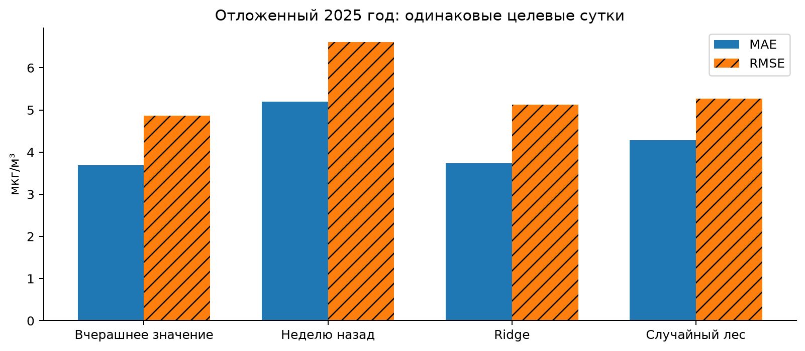
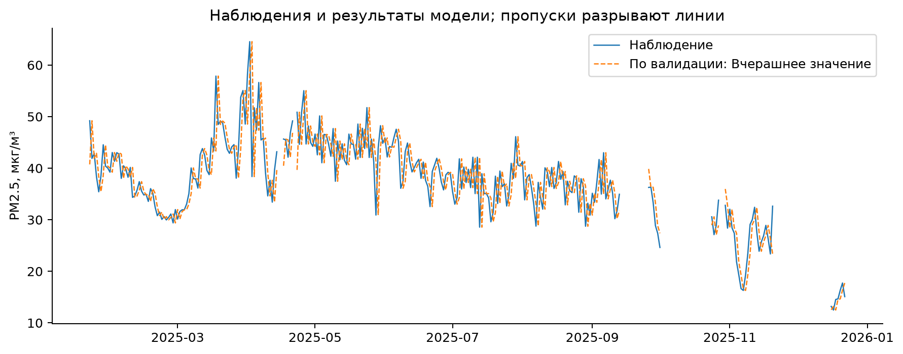
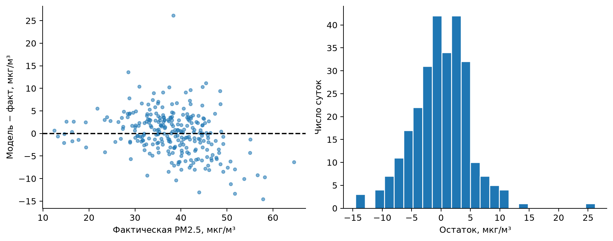
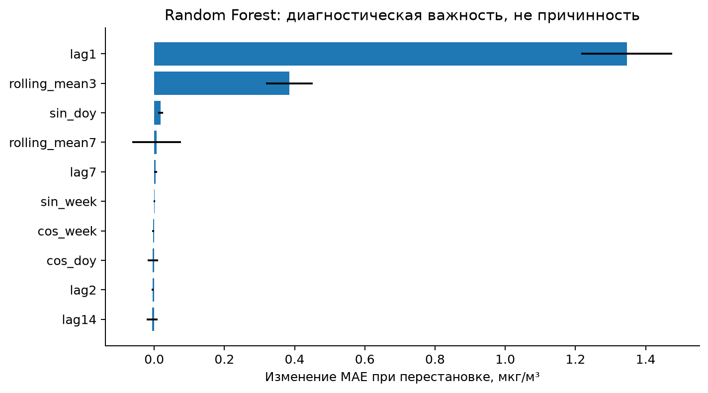
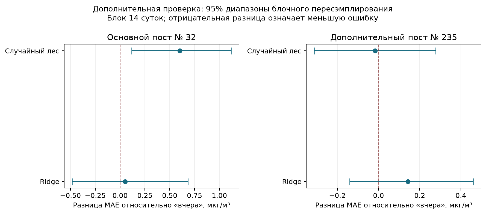

# Однодневный прогноз архивного PM2.5 на посту № 32 в Атырау

Исходный кейс №10. Air Quality Forecasting. Курс: Artificial intelligence and machine learning. Assignment 1. Период 2022–2025. Статус: PARTIAL — ретроспективный эксперимент выполнен, пригодность для оперативного прогноза и калибровка канала не подтверждены.

## Аннотация

Работа прогнозирует средний показатель PM2.5 следующих календарных суток на PCP #8 в Атырау по предыдущим наблюдениям и календарю. Данные и география реальны, но являются ретроспективно очищенным архивом. На 273 отложенных сутках итоговой проверки 2025 года persistence даёт MAE 3.686 и RMSE 4.863 мкг/м³. Ridge даёт MAE 3.736, Random Forest — 4.287. Победитель выбран на validation до открытия test: сохранение последнего наблюдения. Усложнение модели не улучшило результат. При этом выявленная межфракционная несогласованность канала и неизвестная задержка публикации ограничивают переносимость результата на реальное качество воздуха. Все результаты рассчитаны по сохранённым CSV. Исходное вычисление: 25.09.2026; повторный научный аудит и редакция: 26.09.2026. Использованы реальные опубликованные измерительные записи, а не синтетические данные. Однако принадлежность записи архиву не подтверждает исправность канала: нужна независимая проверка калибровки. Работа выполнена с раскрываемой ИИ-помощью; авторские реквизиты студента не установлены и не выдуманы.

## 1. Задача, объект и границы

В отличие от описательного кейса №1 здесь задаётся единственная будущая величина. Для даты t прогноз выпускается в 00:00 местного времени UTC+5 и относится к среднему PM2.5 за интервал [t 00:00, t+1 00:00). Горизонт — следующие 24 часа, частота выдачи — одни сутки. Истинная метка требует как минимум 18 уникальных часовых наблюдений. Последний потенциально доступный загрязняющий показатель относится к t−1; фактическая погода дня t никогда не включается.

Это идеализированный момент выпуска в ретроспективной проверке: в исходном архиве нет времени поступления/утверждения показания. Предположение, что вчерашнее среднее уже известно ровно к полуночи, не проверено и не выдаётся за эксплуатационное свойство. Такой benchmark отвечает на вопрос о статистической предсказуемости архивного канала; для запуска сервиса нужен архив версий данных по времени фактической доступности.

Исследовательские вопросы: превосходит ли обученная модель persistence; помогает ли гибкая модель деревьев относительно регуляризованной линейной модели; меняется ли ошибка по сезонам и при высоких фактических значениях; какие ограничения мешают использовать прогноз для принятия решений. Основной критерий — MAE. RMSE сильнее реагирует на большие ошибки; R² дополняет картину и не используется для изменения состава test.

## 2. Краткий обзор методов и источников

AirData.kz публикует согласованные по формату измерительные архивы с исходной единицей и описанием предварительного контроля [1,2]. Это полезно для воспроизводимости, но предварительная очистка меняет популяцию оцениваемых значений. В отличие от прямого потока датчика здесь нельзя восстановить все отвергнутые пики или точно установить, когда они были доступны.

Официальный пример scikit-learn показывает построение лаговых признаков и необходимость временного разделения [11]. Механизм здесь тот же: исторические значения превращаются в признаки табличной регрессии, однако разделение сохраняет направление времени. Persistence использует автокорреляцию напрямую, сезонный naive проверяет недельное повторение. Ridge ограничивает коэффициенты, а Random Forest допускает нелинейные взаимодействия. Сложная рекуррентная сеть не требуется, чтобы проверить наличие полезного сигнала.

Локальные исследования H₂S [10] и сообщения Казгидромета [3] подтверждают многообразие загрязняющих каналов в Атырау. Модель только PM2.5 не может заменять мониторинг запахов или газов. Пороговые ориентиры ВОЗ [5,6] относятся к воздействию; регрессионная MAE не является медицинской оценкой и не гарантирует корректного предупреждения об опасности.

Регуляризованная линейная модель проверяет, достаточно ли аддитивной зависимости от прошлого; лес проверяет полезность нелинейных порогов и взаимодействий. Оба метода сравниваются с простым правилом «завтра как вчера» на одинаковых датах. Поэтому вопрос работы — не демонстрация сложности алгоритма, а добавленная прогностическая ценность. При заметном сдвиге уровня ряда лаговый ориентир может сохранять актуальную информацию лучше модели, обученной на другом периоде; в настоящей работе это проверяется эмпирически.

Для оценки устойчивости разницы ошибок при повторном аудите использована идея блочного пересэмплирования зависимых наблюдений Кюнша [12]. Она сохраняет короткие временные последовательности при формировании повторных выборок. Такой анализ дополняет единичное значение MAE, но при неизвестной стационарности и пропусках не даёт гарантированного интервала для будущего качества модели.

## 3. Данные и их качество

Использован тот же зафиксированный почасовой архив, что в кейсе №1: AirData.kz commit 0fe9a615baf614346e282796f685ce72b852187f, идентификатор поста — 32, PCP #8, координаты 47.096617, 51.942701. Это один общий исходный источник, а не два независимых датасета. Производная таблица данного кейса отличается: одна строка — будущие сутки с target и допустимыми историческими признаками. Хеш таблицы и признаки записаны в models/metadata.json.

Календарная сетка содержит 1461 дат; пригодный target имеется на 1209 из них. Для честного сравнения двух naive-baseline дополнительно требуются реальные значения t−1 и t−7. Это исключает 101 суток; итоговая моделируемая выборка содержит 1108 строк. Пропущенные target не интерполированы. Исключение из-за отсутствия лагов может смещать оценку в сторону стабильных периодов работы станции: тест характеризует именно такие условия.

Метрологическое ограничение из кейса №1 сохраняется: PM2.5 превышает парную PM10 в 845 из 1209 пригодных суток. Это не устранено моделью. Даже точный прогноз систематически смещённого или ошибочно названного канала не доказывает точность прогноза физической концентрации. Поэтому результаты называются прогнозом архивного показателя, а не валидированной системой предупреждения.

## 4. Признаки и защита от временной утечки

Используются лаги 1,2,3,7,14 суток; средние прошлых 3,7,14 суток; стандартное отклонение за предыдущие 7 суток; синус и косинус дня года и дня недели. Для каждого rolling сначала применяется shift(1). В среднем за окно 7 суток участвуют только t−7…t−1. Допускается неполное окно при заранее заданном минимуме наблюдений; оставшиеся пропуски признаков заменяются медианой, вычисленной только на train, с дополнительным индикатором отсутствия.

Календарь дня t известен заранее. Ни PM2.5 дня t, ни будущая погода, ни значения t+1 не попадают в признаки. Признак latest_feature_date сохраняется для аудита и не передаётся модели. В коде проверяется совпадение lag1 с фактическим предыдущим днём полной календарной сетки; shift по разреженной таблице не используется. Разделённые цели — непересекающиеся календарные сутки, поэтому дополнительный embargo для перекрывающихся целевых окон здесь не нужен.

Собственная обработка причинно направлена, но нельзя утверждать полное отсутствие look-ahead в источнике: поставщик применяет фильтры соседних скачков, «застывших» датчиков и пространственной согласованности [2]. Оценка остаётся offline. Для строго operational backtest необходимы сырые versioned записи и временные метки их доступности.

## 5. Разделение и реально проведённое обучение

| Часть выборки | Начало | Конец | Сутки |
| --- | --- | --- | --- |
| Обучение | 2022-01-19 | 2023-12-31 | 631 |
| Валидация | 2024-01-01 | 2024-10-08 | 204 |
| Проверка | 2025-01-21 | 2025-12-22 | 273 |

Train ограничен 2022–2023 годами, валидация — 2024, итоговая проверка — 2025. Это одна фиксированная хронологическая валидация; повторная настройка на итоговой проверке не проводилась. На validation проверены три Ridge (alpha=0.1,1,10) и две конфигурации Random Forest (200 деревьев, max_depth8, лист 3/10). Seed42 и параметры сохранены. В каждой конфигурации imputer/scaler обучаются только на обучающей части. Лучшие по семействам затем переобучаются на обучающая и валидационная части и один раз оцениваются на итоговой проверке.

Таблица 1. Результаты validation. MAE/RMSE в мкг/м³.

| Модель | MAE | RMSE | R² | Сутки |
| --- | --- | --- | --- | --- |
| ridge_0.1 | 8.086 | 11.038 | 0.521 | 204 |
| ridge_1.0 | 8.052 | 10.991 | 0.525 | 204 |
| ridge_10.0 | 7.974 | 10.866 | 0.536 | 204 |
| forest_3 | 12.890 | 19.673 | -0.521 | 204 |
| forest_10 | 12.525 | 19.178 | -0.445 | 204 |
| Вчерашнее значение | 6.273 | 9.034 | 0.679 | 204 |
| Неделю назад | 10.100 | 14.510 | 0.173 | 204 |

Самый низкий validation MAE получает persistence. Этот выбор сохранён, хотя обе обучаемые модели всё равно обучены и оценены как предусмотренные альтернативы. Seasonal naive использует PM2.5 на t−7. Baseline не требует весов: его точное правило записано в models/baseline.json. Ridge и Random Forest сохранены как joblib вместе с обученными преобразованиями; скачанные непроверенные pickle не использовались.

## 6. Результат отложенной проверки

Таблица 2. Метрики на одном наборе 273 суточных целей 2025 года.

| Модель | MAE | RMSE | R² | Сутки |
| --- | --- | --- | --- | --- |
| Вчерашнее значение | 3.686 | 4.863 | 0.633 | 273 |
| Неделю назад | 5.195 | 6.613 | 0.322 | 273 |
| Ridge | 3.736 | 5.127 | 0.592 | 273 |
| Случайный лес | 4.287 | 5.270 | 0.569 | 273 |

Выбранная модель сохраняет последнее наблюдение; её MAE совпадает с MAE правила «вчера» по определению. MAE модели Ridge выше, чем у правила «вчера», на 1.35%, а MAE случайного леса — на 16.32%. Более гибкая модель не оказалась сильнее линейной. Это согласуется с тем, что простой лаг может нести больше устойчивого сигнала, чем выученные при другом уровне ряда пороги деревьев.

График показывает характер persistence: предсказание повторяет предыдущую доступную суточную концентрацию и реагирует на сдвиг с задержкой. Близость большей части точек не означает надёжность на резких изменениях. По сравнению с кейсом №1 здесь существенно меньше ошибка, поскольку последнее наблюдение содержит локальный уровень канала; это не сравнение одинаковых задач и не доказательство преимущества модели по погоде.

## 7. Ошибки, сезоны и высокие значения

Таблица 3. Сезонные результаты persistence на итоговой проверке. Малые группы не дают надёжного прогноза ежегодной сезонности ошибки.

| Сезон | Модель | MAE | RMSE | R² | Сутки |
| --- | --- | --- | --- | --- | --- |
| Весна | Вчерашнее значение | 4.814 | 6.348 | -0.023 | 89 |
| Зима | Вчерашнее значение | 2.091 | 2.817 | 0.903 | 46 |
| Лето | Вчерашнее значение | 3.552 | 4.418 | -0.174 | 92 |
| Осень | Вчерашнее значение | 3.366 | 3.923 | 0.564 | 46 |

Таблица 4. Крупнейшие абсолютные ошибки выбранного прогноза, мкг/м³.

| Дата | Факт | Вчерашнее значение | Абс. ошибка |
| --- | --- | --- | --- |
| 2025-04-03 | 38.369 | 64.546 | 26.177 |
| 2025-03-18 | 57.864 | 43.330 | 14.534 |
| 2025-07-13 | 28.562 | 42.129 | 13.568 |
| 2025-04-04 | 51.727 | 38.369 | 13.358 |
| 2025-05-29 | 43.942 | 30.908 | 13.035 |
| 2025-04-23 | 50.851 | 39.666 | 11.185 |

Порог высоких значений определён как 90-й процентиль целевой величины в обучающей и валидационной частях: 80.590 мкг/м³. В итоговой проверке выше него находятся 0 суток. Поэтому качество прогноза пиков по заранее заданному правилу НЕ ОЦЕНЕНО, а results/peak_metrics.csv содержит только остальные дни. Порог не снижен после просмотра проверки ради получения удобной группы. Это статистический порог, а не санитарный уровень опасности; Precision и Recall предупреждений также не рассчитаны.

Ошибки могут усиливаться после пропусков, при изменении базового уровня и при скачках. Однако условия сравнения требуют настоящих t−1 и t−7 и тем самым исключают часть наиболее трудных случаев восстановления после длительного сбоя. Работа не даёт оценки «всегда доступного» сервиса. Модель также не имеет независимо проверенных вероятностных интервалов; интервалы надёжности не нарисованы произвольно.

## 8. Интерпретация и ограничения

Перестановка признаков выполняется только как диагностический анализ после фиксации эксперимента. Она не меняет выбранную модель и не устанавливает причинность. Лаги и скользящие средние коррелируют; распределение важности между ними может быть нестабильным. Результат относится к конкретному обученному лесу на конкретном test, а не к физическим источникам PM.

Прогнозируемость архивного канала определяется автокорреляцией и правилами отбора провайдера. Важные ограничения: неполнота 2024 года, межгодовой сдвиг показателя, физическая несогласованность частиц, неизвестная калибровка и задержка публикации, единственная станция и один test-год. Внешние города не использованы для обучения; они не являются доказательством пространственной переносимости. Ввод ERA5 того же дня дал бы будущую информацию и поэтому отсутствует.

Низкая ошибка на спокойном канале может сочетаться с плохой чувствительностью к редким эпизодам. Следующая корректная проверка должна включать независимые сырые измерения, versioned флаги и заранее сохранённый период будущих наблюдений. Данные проверки за 2025 год не следует использовать снова для подбора «улучшенной» сетки параметров.

## Дополнительный исследовательский эксперимент: PCP #10, ID 235

После обнаружения проблемы 32 проведена ограниченная проверка на более согласованном канале 235. Это последующий исследовательский анализ, а не замена зафиксированного основного test. При исходном суточном сравнении PM2.5 > PM10 встречалось здесь в 1 из 1300 суток. При последующем соединении строго одинаковых часов получается 0 из 1300, поэтому этот единичный случай объясняется разным часовым покрытием. Координаты станции: 47.114687,51.860907; её метки и физическое расположение отличаются от 32.

Лаги, календарь, правило 18 часов, годы train/validation/test и значения гиперпараметров сохранены из основного эксперимента. Взяты клоны уже выбранных по 32 pipelines, переобученные на 235 за 2022–2024. На 235 не проводились поиск, выбор признаков или настройка по test. Правило выбора persistence также сохранено из основного эксперимента. Число обучающих строк=864, test=353; среднее target test=5.845, стандартное отклонение=7.618 мкг/м³.

Таблица 5. Исследовательская проверка переноса фиксированной методики на 235; MAE/RMSE в мкг/м³.

| Модель | MAE | RMSE | R² | Сутки |
| --- | --- | --- | --- | --- |
| Вчерашнее значение | 2.928 | 5.430 | 0.490 | 353 |
| Неделю назад | 4.609 | 8.231 | -0.171 | 353 |
| Ridge | 3.071 | 4.977 | 0.572 | 353 |
| Случайный лес | 2.912 | 4.915 | 0.583 | 353 |

Ошибка между станциями не сравнивается как рейтинг моделей: целевые распределения и даты пригодности различаются. Результат показывает доступность альтернативного местного канала и его предсказуемость при фиксированной методике. Независимая калибровка и реальные временные метки поступления всё ещё нужны. Predictions, dataset, metadata и метрики сохранены отдельно в results/sensitivity235; веса — models/sensitivity235.

### Устойчивость разницы ошибок: последующий анализ

Для каждого тестового дня рассчитана парная разница абсолютных ошибок: ошибка обученной модели минус ошибка правила «вчера». Из календаря 2025 года выбирались с возвращением последовательные блоки 7, 14 и 28 суток; пропуски сохранялись, а целевые значения не заполнялись. Выполнено 5000 повторов с seed = 42. Таблица показывает среднюю разницу и 2,5-й–97,5-й процентили пересэмплированных средних для блока 14 суток [12]. Все длины блоков опубликованы в results/paired_error_block_sensitivity.csv; ни одна не использовалась для выбора модели.

Таблица 6. Разница MAE относительно правила «вчера», мкг/м³. Отрицательный знак означает меньшую ошибку модели.

| Эксперимент | Модель | Разница MAE | Нижняя граница | Верхняя граница |
| --- | --- | --- | --- | --- |
| Пост № 32 | Ridge | 0.050 | -0.484 | 0.684 |
| Пост № 32 | Случайный лес | 0.602 | 0.116 | 1.117 |
| Пост № 235 | Ridge | 0.142 | -0.139 | 0.460 |
| Пост № 235 | Случайный лес | -0.017 | -0.312 | 0.278 |

Небольшой выигрыш леса на посту № 235 неустойчив: диапазон пересекает ноль. Для основного поста № 32 лес имеет большую наблюдаемую MAE. Диапазоны условны относительно уже обученных моделей и наблюдённых данных; стационарность, механизм пропусков и репрезентативность года не подтверждены. Поэтому это исследовательская проверка чувствительности, не подтверждающий статистический тест и не интервал будущего отдельного прогноза. Основной выбор по валидации остаётся прежним.

## 9. Практические рекомендации

Сначала запросить паспорт канала 32 и объяснение частых PM2.5>PM10; до этого не выдавать значения как проверенный прогноз воздействия. Затем обеспечить архив фактического времени получения и утверждения показаний. Прогноз следует выпускать после гарантированного закрытия предыдущих суток или использовать более ранний lag, честно изменив origin и заново оценив метод.

Для прототипа исследовательской панели достаточно persistence как прозрачного контрольного ориентира, отображения последней доступной даты и статуса данных. При пропуске вчерашнего значения систему нужно помечать как не имеющую входных данных; отсутствие прогноза не означает хорошее качество воздуха. Сложный ML оправдан только после подтверждённого прироста на новом периоде. Перед эксплуатацией отдельно оценить пороговые решения, задержку выдачи, частоту отказов и калибровку неопределённости.

## 10. Заключение и воспроизведение

RQ1: обученные модели не превосходят persistence на выбранной схеме. RQ2: Random Forest имеет большую MAE, чем Ridge; гибкость не дала выигрыша. RQ3: сезонные и крупнейшие ошибки доступны в сохранённых таблицах, но ограничены одним годом и фильтром доступности. RQ4: основной барьер для применения — качество и время доступности исходного канала, а не отсутствие более сложного алгоритма.

Запуск из корня пакета: `python 02_Air_Quality_Prediction/pipeline.py`. Общая проверка: `python 01_Air_Pollution/pipeline.py --verify`. Notebook выполнен из чистого kernel и сохраняет результаты вычислений. Predictions содержат forecast_origin, target_date, latest_feature_date, actual и все варианты прогноза; метрики пересчитываются из этих столбцов. Итоговый статус PARTIAL сохраняется до подтверждения метрологии и оперативной доступности данных.

## Литература

1. AirData.kz / Global Shapers Almaty Hub. Open Air Quality Dataset for Kazakhstan. Kazakhstan; 2020–2026. URL: https://github.com/qazybekb/AirDatakz-OpenData (обращение: 25.09.2026).
2. AirData.kz. Datasheet for Dataset: AirData.kz Open Air Quality Data. Kazakhstan; 2017–2026. URL: https://github.com/qazybekb/AirDatakz-OpenData/blob/0fe9a615baf614346e282796f685ce72b852187f/DATASHEET.md (обращение: 25.09.2026).
3. РГП Казгидромет. Мониторинг промышленной зоны Атырау. Atyrau; 2021. URL: https://www.kazhydromet.kz/ru/post/1063 (обращение: 25.09.2026).
4. Bureau of National Statistics of Kazakhstan. 21.2.a Air quality. Kazakhstan; annual since 2014. URL: https://stat.gov.kz/en/open-data/pollution/482928/ (обращение: 25.09.2026).
5. World Health Organization. WHO global air quality guidelines. Global; 2021. URL: https://www.who.int/publications/i/item/9789240034228 (обращение: 25.09.2026).
6. World Health Organization. What are the WHO Air quality guidelines?. Global; 2021. URL: https://www.who.int/news-room/feature-stories/detail/what-are-the-who-air-quality-guidelines (обращение: 25.09.2026).
7. Министерство здравоохранения Республики Казахстан. Об утверждении Гигиенических нормативов к атмосферному воздуху. Kazakhstan; 2022, amended 2025. URL: https://old.adilet.zan.kz/rus/docs/V2200029011 (обращение: 25.09.2026).
8. Open-Meteo / Copernicus / ECMWF. Historical Weather API, ERA5. Atyrau ERA5 grid point; 2022–2025. URL: https://open-meteo.com/en/docs/historical-weather-api (обращение: 25.09.2026).
9. Гидрометеорология и экология. Инвентаризация источников загрязнения атмосферного воздуха Западно-Казахстанского региона. Western Kazakhstan four regions; 2018–2022. URL: https://journal.kazhydromet.kz/kazgidro/article/view/2341 (обращение: 25.09.2026).
10. M. Yessenamanova, Z. Yessenamanova, A. Tlepbergenova, G. Batyrbayeva. Analysis of the Content of Hydrogen Sulfide in the Air of the City of Atyrau. Atyrau; 2020 observations; published 2021. URL: https://www.iieta.org/journals/ijsdp/paper/10.18280/ijsdp.160308 (обращение: 25.09.2026).
11. scikit-learn developers. Lagged features for time series forecasting. Methodological; accessed 2026. URL: https://scikit-learn.org/stable/auto_examples/applications/plot_time_series_lagged_features.html (обращение: 25.09.2026).
12. Hans R. Künsch. The Jackknife and the Bootstrap for General Stationary Observations. Annals of Statistics 17(3), 1217–1241. Methodological; 1989. URL: https://doi.org/10.1214/aos/1176347265 (обращение: 26.09.2026).
