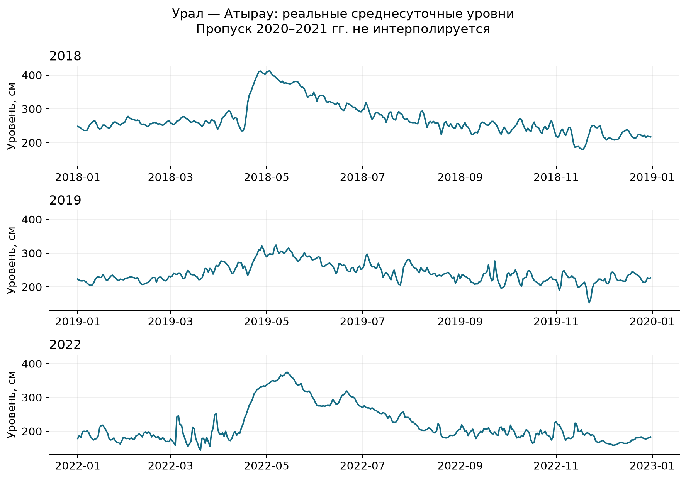
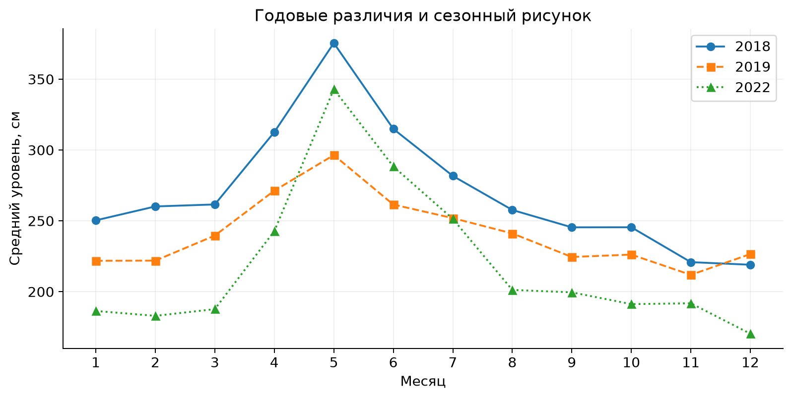
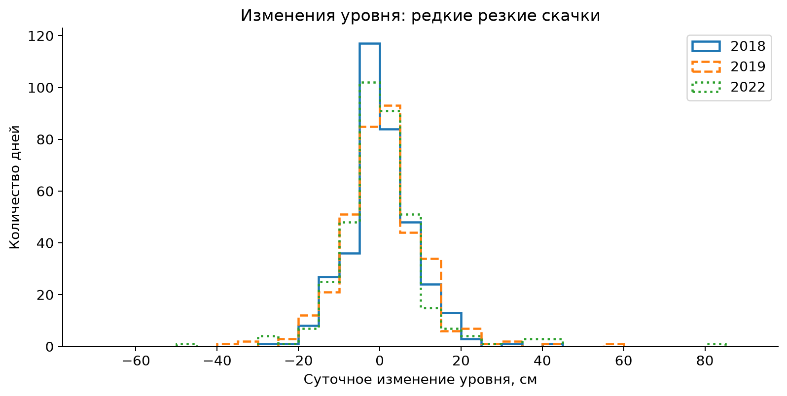
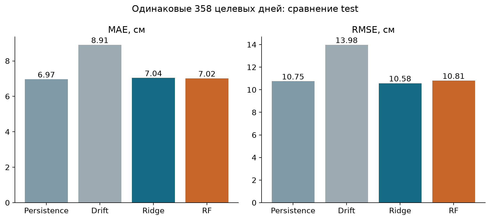
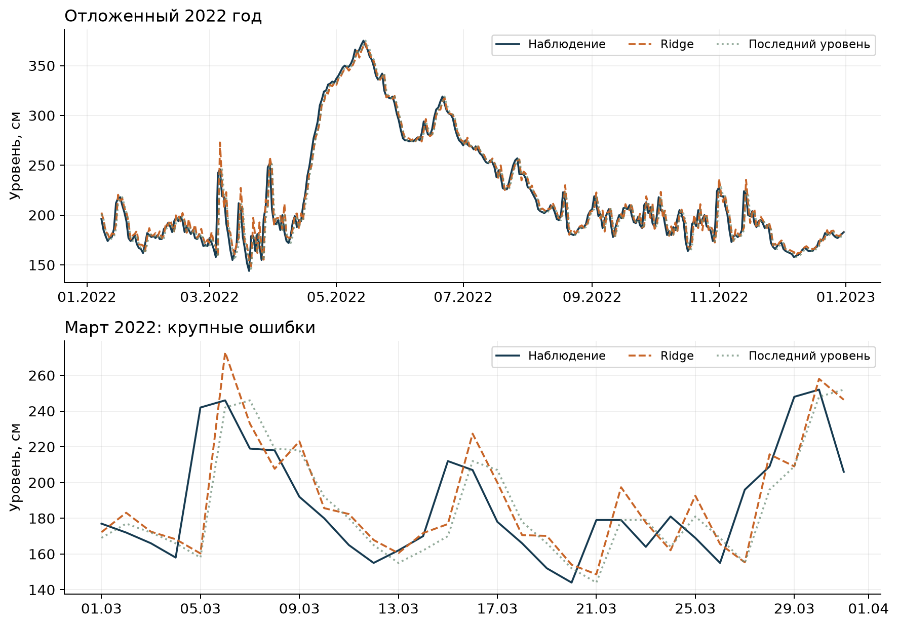
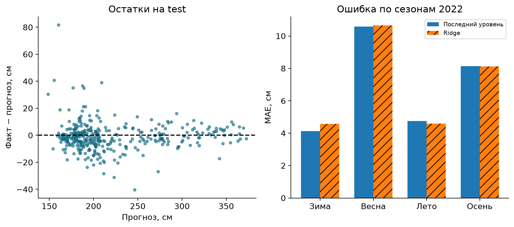

# Среднесуточный уровень Урала в Атырау: прогноз на один день и replay наблюдений

Исходный кейс №12 — Smart Water Management Using IoT and Sensor Data. Курс «Искусственный интеллект и машинное обучение». Assignment 1. Исследование выполнено 25.09.2026, повторный аудит — 26.09.2026. Помощь ИИ раскрыта; студент должен самостоятельно проверить методы и выводы перед защитой. Статус соответствия исходному кейсу — PARTIAL: подтверждён архивный аналитический прототип, действующая IoT-интеграция не проверялась.

## Аннотация

Исследование проверяет практическую ценность краткосрочного прогноза уровня воды и простого журнала контроля наблюдений на посту 19802, Урал — Атырау. Из трёх официальных ежегодников Казгидромета извлечены 1095 среднесуточных значений за 2018, 2019 и 2022 годы. Разрыв 2020–2021 годов оставлен незаполненным. Корректность извлечения проверена по 36 опубликованным месячным средним, максимальное отклонение 0.5 см объясняется округлением. Использованы два baseline, Ridge и Random Forest; параметры выбраны только по 2019 году, итоговая проверка выполнена на 358 днях 2022 года. Выбранная Ridge дала MAE 7.039 см и RMSE 10.577 см. Persistence имеет MAE 6.966 см: улучшения по главному критерию нет (-1.04%). Replay обработал 365 последовательных записей и сформировал 8 статистических флагов для ручного разбора. Это исследовательская проверка на исторических данных; живая IoT-интеграция, предотвращение ущерба и надёжность аварийных предупреждений не заявляются.

## 1. Проблема и исследовательские вопросы

Для управления наблюдениями нужны понятные ответы: что ожидается на следующий день, насколько ошибается метод и какие записи требуют проверки. Архивная таблица сама по себе не обеспечивает такую последовательность решений. При этом название «умный мониторинг» не освобождает исследователя от проверки происхождения измерений, временных границ и честного сравнения с простыми правилами.

Атырауский пост выбран по наличию локальных ежедневных данных. Ведомственный источник подтверждает длительную работу поста и наблюдения за уровнем, температурой, льдом и стоком [W_HISTORY]. В данном эксперименте применяется только уровень воды: наличие других наблюдаемых величин у организации не означает, что их совместимый ряд уже получен. Результаты относятся к одному посту и выбранным годам, без пространственного обобщения на весь бассейн.

Вопрос RQ1: какие различия уровня и суточной изменчивости видны в фактической выборке? Вопрос RQ2: улучшает ли обучаемая модель прогноз среднесуточного уровня следующего дня относительно persistence? Вопрос RQ3: в какие периоды прогноз ошибается сильнее и почему этих данных недостаточно для причинного объяснения? Вопрос RQ4: можно ли воспроизвести поток наблюдений и получить проверяемый журнал предложенных действий без фиктивных аварийных меток?

Критерием успеха RQ2 заранее выбран MAE на неизменном test. Успех реализации RQ4 означает совпадение последовательных и пакетных прогнозов на общих датах и сохранение каждого предложенного действия; он не означает выявление опасности. Эти вопросы отделяют количественную проверку модели от демонстрации процесса мониторинга.

## 2. Обзор источников и методическая позиция

Гидрологические ежегодники Казгидромета — первичный опубликованный источник используемого ряда. В пояснениях к таблице 1.2 за 2018 год (PDF с.21–22) среднесуточный уровень определяется по двухсрочным наблюдениям в 08:00 и 20:00 либо по более частым отсчётам; при многосрочном режиме применяется взвешивание по времени [W2018]. Поэтому единица анализа — день, а не отдельный отсчёт датчика. Из этого описания нельзя установить конкретный прибор, протокол связи или наличие автоматической телеметрии на посту.

Короткий горизонт требует сильного baseline. В исследовании операционной системы GloFAS persistence используется как ориентир для коротких сроков, когда существенна временная зависимость стока [W_GLOFAS]. В нашей работе прогнозируется уровень, а не расход; результаты GloFAS не переносятся численно. Методический вывод ограничен необходимостью сравнивать сложный прогноз с последним доступным значением.

Hyndman и Athanasopoulos подчёркивают оценку на данных, не участвовавших в обучении, и различие между обучающими остатками и прогнозными ошибками [W_FPP]. Здесь validation выбирает параметры, test оценивает окончательное решение. MAE выражает типичный абсолютный масштаб ошибки, RMSE сильнее реагирует на крупные промахи. MAPE не используется: ноль уровня задан относительно репера, а не представляет физически абсолютное отсутствие воды.

Ridge добавляет L2-регуляризацию к линейной регрессии [W_RIDGE]. Она подходит для компактного набора взаимосвязанных лаговых признаков. Random Forest — альтернативная нелинейная модель на деревьях [W_RF]. Выбор этих методов не утверждает их универсальное превосходство; он проверяет, добавляет ли регуляризация или нелинейность пользу в сравнении с инерционностью ряда. Глубокая сеть при небольшом числе лет и отсутствии оперативной метеоинформации не является необходимым усложнением.

## 3. Данные, получение и проверка качества

Источник — таблица 1.2, пост 19802, страницы PDF 35 (2018), 35 (2019), 37 (2022). Каждый год содержит 365 опубликованных суточных уровней. Ноль поста указан как −30,00 м БС; сами значения уровня измерены в сантиметрах относительно этого нуля [W2018; W2019; W2022]. Высота репера и уровень воды — разные величины. Пороги другого поста или другого усреднения к ним не применяются.

Проверка выполнимости началась с официальной гидрологической базы и ежедневных бюллетеней. Объявление об открытии базы подтверждает наличие ведомственного архива, но прямое получение подходящего ряда через проверенный endpoint не удалось [W_DB]. Каталог водного кадастра на момент проверки показывал форму авторизации [W_CATALOG]; вход не обходился. Три конкретных PDF были найдены в открытой поисковой выдаче и скачаны по общедоступным прямым ссылкам. Ежедневный бюллетень 06.04.2025 также содержит Атырау, но единичный бюллетень не заменяет длительный ряд [W_BULLETIN].

Отбор годов обусловлен доступностью проверяемых файлов. Это не случайная выборка лет. Промежуточные 2020 и 2021 годы не включены, и такое отсутствие нельзя называть нулевым уровнем либо отсутствием событий. Годы позднее 2022 в эксперименте не оцениваются. В частности, на этой выборке невозможно доказать работоспособность в условиях последующих крупных паводков.

Извлечение выполняет code/prepare_data.py. Для каждой дневной строки проверяется число допустимых календарных месяцев; несуществующие 29–31 числа не превращаются в записи. Для каждой записи сохранены год источника, страница, идентификатор и оригинальные буквенные/символьные пометки. Пометки остаются контекстом источника и не используются как прогнозные признаки. Порядок столбцов и отдельные значения проверены по изображениям всех трёх страниц. Все 36 месячных средних пересчитаны и согласуются с опубликованными в пределах округления. Нулевые пропуски относятся к извлечённым трём годам; это не означает полноту всего периода 2018–2022.

Полные PDF имеют © Казгидромет; явная открытая лицензия не обнаружена. В распространяемый пакет включены извлечённые числовые факты, ссылки, скрипт и SHA-256, а полные исходные книги исключены. Разрешение на коммерческое переиздание этим пакетом не предоставляется. Исходные журналы наблюдателя и история ведомственных уточнений недоступны, поэтому опубликованный ряд нельзя считать необработанным потоком датчика. Собственная подготовка не заполняет пропуски и не интерполирует цели. При повторном извлечении SHA-256 каждого PDF проверяется до чтения таблицы; изменившийся источник приводит к остановке, а не к незаметной замене эксперимента.

Таблица 1. Фактический охват и описательная статистика (results/annual_summary.csv).

| Год | Дней | Средний, см | Мин., см | Макс., см | SD, см |
| --- | --- | --- | --- | --- | --- |
| 2018 | 365 | 270.50 | 180 | 413 | 48.39 |
| 2019 | 365 | 241.38 | 153 | 324 | 28.36 |
| 2022 | 365 | 219.91 | 144 | 375 | 55.02 |

## 4. Разведочный анализ

Средние уровни в выбранные годы различаются; это видно в таблице 1 и на рисунке 1. Данные показывают более высокий средний уровень в 2018 году, чем в 2019 и 2022. Однако три выбранных по доступности года, разделённые пропуском, не обосновывают долговременный тренд или его причины. Минимумы и максимумы таблицы вычислены по суточным средним. Их нельзя приравнивать к экстремумам отдельных отсчётов, которые ежегодник также публикует отдельно.

Средние месячные профили показывают весенне-летний подъём, но его высота и форма различаются между годами. Это описательная сезонная структура имеющегося набора, а не оценка стабильной климатической нормы. Для такой нормы нужен значительно более длинный и проверенный ряд. Календарные признаки включены как известная заранее информация, но само наличие синуса и косинуса в модели не доказывает устойчивость годовой закономерности.

Гистограмма изменений показывает, что большинство соседних значений близки, но встречаются резкие скачки. Инерционность объясняет силу persistence: при спокойной динамике последний уровень уже даёт полезную начальную оценку. Скачок нельзя автоматически объявить неисправностью. Пояснения к ежегоднику отдельно отмечают влияние сгонно-нагонных явлений Каспийского моря на посты низовьев, включая Атырау [W2018, с.22,70]. Это физический контекст, а не рассчитанная в данном эксперименте причинная доля.

## 5. Методология и защита от утечки

План EXPERIMENT_PLAN.md сохранён до первого обучения. В момент прогноза завершён день t, а целью является среднесуточный уровень H(t+1). В архивах нет времени публикации окончательного среднего, поэтому предполагаемая доступность H(t) — условие ретроспективного эксперимента. Не утверждается, что такая же точность автоматически достижима в оперативной службе с задержками данных.

Persistence задаёт Ĥ(t+1)=H(t), а drift — Ĥ(t+1)=2H(t)−H(t−1). Обучаемые модели предсказывают суточное изменение; затем прогноз изменения прибавляется к H(t). Набор признаков: последний уровень, три прошлых суточных изменения, отклонение последнего уровня от среднего за три и семь дней, среднее изменение внутри последнего семидневного окна, синус и косинус календарного дня цели. Все измеряемые признаки строго предшествуют цели; будущая погода, будущие уровни и пометки целевого дня отсутствуют.

Семидневное окно содержит семь уровней и шесть межсуточных приращений. Поэтому mean_change7 = (H(t)−H(t−6))/6, единица этого признака — см/сутки. Это уточнение формулы уже реализованного признака, а не добавление новой переменной после просмотра test.

Разделение определяется годом цели: train 2018, validation 2019, test 2022. Из начала каждого непрерывного отрезка исключаются семь дней без полной истории признаков. Для начала 2019 года разрешены наблюдения конца 2018: они действительно предшествуют прогнозу. Для января 2022 такой истории нет, поэтому оценка начинается 8 января. Разрыв 2020–2021 не перескакивается при построении лагов. Пересечение измеренных прошлых окон между соседними прогнозами допустимо; пересечения целевых дат между выборками нет.

Таблица 2. Зафиксированное разбиение (models/metadata.json).

| Этап | Год | Целей | Первая дата | Последняя дата |
| --- | --- | --- | --- | --- |
| Обучение | 2018 | 358 | 2018-01-08 | 2018-12-31 |
| Выбор модели | 2019 | 365 | 2019-01-01 | 2019-12-31 |
| Итоговая оценка | 2022 | 358 | 2022-01-08 | 2022-12-31 |

Ridge: StandardScaler внутри pipeline и alpha из {0.1, 1, 10, 100}. Random Forest: 200 деревьев, глубина 6, min_samples_leaf из {3,10}, seed 42. Для настройки скейлер и модели используют только train. Минимальный validation MAE выбирает модель и параметры. После фиксации Ridge alpha=100 и RF min_samples_leaf=3 обе модели переобучены на train+validation; test не участвует ни в настройке, ни в fit. Критерий выбора не меняется после просмотра итоговой таблицы.

MAE = mean(|H−Ĥ|); RMSE = sqrt(mean((H−Ĥ)²)); R² = 1−SSE/SST. Все ошибки указаны в сантиметрах, кроме безразмерного R². Сравнение выполняется на одинаковых датах. Высокий R² может возникать при выраженном годовом диапазоне и не заменяет сравнение с persistence. Доверительные интервалы и статистическая значимость различий не рассчитывались.

## 6. Результаты обучения и итоговая проверка

Таблица 3. Валидация; показана лучшая настройка каждой обучаемой модели.

| Метод | MAE, см | RMSE, см | R² |
| --- | --- | --- | --- |
| Последний уровень | 7.107 | 9.891 | 0.878 |
| Продолжение изменения | 8.562 | 12.415 | 0.808 |
| Ridge | 6.596 | 9.478 | 0.888 |
| Random Forest | 6.680 | 9.318 | 0.892 |

На validation по MAE выиграла Ridge. Тестовая таблица сохраняет это заранее выбранное решение. Если другой метод выглядит лучше на test, это не даёт основания объявить его заранее выбранным победителем или изменить гиперпараметры. Полный поиск сохранён в validation_search.csv; фактически выполнено 6 обучений кандидатов и 2 финальных переобучения.

Таблица 4. Неизменный test 2022 года, 358 целей.

| Метод | MAE, см | RMSE, см | R² |
| --- | --- | --- | --- |
| Последний уровень | 6.966 | 10.752 | 0.962 |
| Продолжение изменения | 8.911 | 13.981 | 0.936 |
| Ridge | 7.039 | 10.577 | 0.963 |
| Random Forest | 7.016 | 10.809 | 0.962 |

Ridge имеет MAE 7.039 см против 6.966 см у persistence. Абсолютная разница составляет +0.072 см, то есть средняя ошибка выбранной модели немного больше. Относительное улучшение, рассчитанное как 100×(MAE_baseline−MAE_model)/MAE_baseline, равно -1.04%. Поэтому преимущество Ridge по основному критерию на этом test не подтверждено. Разница мала; без оценки неопределённости её нельзя объявлять статистически значимым превосходством baseline. Немного меньший RMSE Ridge указывает на иной баланс ошибок, но не отменяет заранее принятого критерия. Random Forest также не даёт преимущества по MAE. Линейное продолжение изменения ошибается заметнее: кратковременное направление часто не сохраняется на следующий день.

## 7. Ошибки, сезоны и обсуждение

Наибольшая абсолютная ошибка выбранной модели составила 81.69 см на дату 2022-03-05. Предыдущий уровень был 158 см, фактический следующий — 242 см, прогноз Ridge — 160.31 см. Такой пример показывает ограничение исключительно авторегрессионных признаков: резкий внешний импульс может отсутствовать в предшествующей неделе. Запись проверена по исходной таблице; её не удаляли ради улучшения метрик. В книге за 2022 рядом с мартовскими значениями есть условные пометки, которые сохранены дословно; их шрифт и кодировку не следует без проверки трактовать как отдельную истинную аварийную метку.

Таблица 5. Сезонные MAE для одинаковых целей 2022 года.

| Сезон | Дней | MAE baseline, см | MAE Ridge, см |
| --- | --- | --- | --- |
| Зима | 83 | 4.133 | 4.569 |
| Весна | 92 | 10.587 | 10.658 |
| Лето | 92 | 4.750 | 4.584 |
| Осень | 91 | 8.132 | 8.114 |

Весна даёт наиболее крупные средние ошибки. Летом Ridge в этом году немного точнее persistence, зимой — хуже. Это разбор результата после фиксации модели, а не новая настройка сезонных моделей. Число зимних целей меньше из-за семидневного прогрева в начале test. Сезонные показатели не являются независимыми повторениями эксперимента и не доказывают, что модель будет столь же точной следующей весной.

Есть две причины осторожной интерпретации. Во-первых, обучаемые зависимости могли измениться между 2019 и 2022 годами; два отсутствующих года не дают проверить переход. Во-вторых, показатели одного поста не описывают осадки во всём бассейне, ветер над морем, ледовые процессы или управление стоком. Корреляция и важность признаков не оценивают вклад этих механизмов. Результат показывает границу выбранной информации и модели, а не отсутствие прогнозируемости речного режима вообще.

## 8. Последовательный replay и поддержка решений

Скрипт code/replay.py читает реальный ряд 2022 года по одной записи. Проверяются конечное числовое значение и последовательность дат. После семи известных дней формируется прогноз следующего дня. Пакетный эксперимент и последовательный replay дают одинаковые прогнозы на всех 358 общих целевых датах; это автоматически проверено. Всего журнал содержит 365 записей и 359 прогнозов, поскольку последний относится к 01.01.2023 и не имеет фактической цели в данном наборе. Он не включён в метрики.

При разрыве дат или нечисловом измерении рабочее окно очищается; следующий прогноз допустим только после семи последовательных валидных дней. Это правило предотвращает повторное использование признаков старого участка ряда. Оно проверено отдельными искусственными тестами отказа, которые не включены в наблюдения, обучение или оценку точности. На фактическом полном ряде 2022 года исправление не изменило ни одного прогноза или статистического флага.

Порог статистического флага установлен как 99-й процентиль |H(t)−H(t−1)| только на 2018+2019: 31 см. Флаг возникает при строгом превышении. В replay отмечено 8 таких записей и 0 нарушений проверки качества. Это не порог опасного уровня и не показатель аварии. Метрики Precision/Recall не вычисляются: подтверждённых меток неисправности либо опасного события нет. Флаг обнаруживает необычность уже полученной записи, поэтому он не является заблаговременным предупреждением о скачке.

Предложенное действие при флаге — сверить запись с первоисточником и соседними наблюдениями, затем передать спорный случай специалисту. При отсутствующем или нечисловом значении требуется проверка сбора данных, а не вывод о состоянии реки. Нормальная запись сохраняется для регулярного наблюдения. Журнал не отправляет сообщения людям и не управляет гидротехническими сооружениями. Предлагаемое учащение наблюдений возможно только как последующее решение ответственного специалиста с учётом реального оборудования.

## 9. Рекомендации и ограничения

Для следующей версии прототипа первым приоритетом является качество входного потока. Оператор наблюдений должен хранить значение вместе с временем измерения, временем публикации, кодом прибора и отметкой исправления. Полученный непрерывный ряд следует проверять до расчёта прогноза: пропуск блокирует выпуск до накопления достаточной истории. Persistence сохраняется обязательным ориентиром и резервным методом. Заменять его Ridge на основании этого test не обосновано: основной показатель немного хуже.

Второй приоритет — разбор восьми отмеченных дат специалистом по гидрологическим наблюдениям. Для каждой даты нужны подтверждение первичной записи, состояние прибора и контекст соседних постов. Итог такого разбора мог бы сформировать независимые метки качества; до него флаги служат списком записей для проверки. Третий приоритет — оценка на новом непрерывном периоде с заранее зафиксированными критериями. Решение о внедрении должно учитывать не только MAE, но и ошибки при резких изменениях, задержку данных и стоимость неверного действия.

Следующий проверяемый эксперимент может добавить заранее доступный прогноз ветра, данные вышележащих постов и сезонно корректные сведения о ледовом режиме. Но эти источники должны быть реально получены, согласованы по времени и отложены в отдельном будущем test. В этом пакете они не подменяются синтетическими столбцами. Нельзя переносить официальный опасный уровень из разового бюллетеня на статистический флаг и считать их взаимозаменяемыми.

Основные ограничения: один пост; три выбранных по доступности года; пробел 2020–2021; архивные окончательные средние вместо подтверждённого оперативного потока; неизвестная автоматизация поста; отсутствие неопределённости прогноза и аварийных меток; непроверенная переносимость на экстремальные события за пределами данных; открытая лицензия на полные ежегодники не найдена. Экономия воды, предотвращённый ущерб и безопасность управления не измерялись. Наличие работающего кода доказывает воспроизводимость вычисления в указанных условиях, но не валидирует эксплуатационную систему.

К исходному заданию относятся два разных уровня готовности. Локальные данные, EDA, обучение, отложенная оценка и последовательный журнал выполнены и воспроизводятся. Реальный сбор с датчиков, телеметрия, проверенные опасные пороги и управление водопользованием требуют внешних данных и оборудования. Их нельзя закрыть изменением текста или демонстрацией архивного replay, поэтому общий статус кейса остаётся PARTIAL.

## 10. Выводы и воспроизводимость

RQ1 получил ответ в годовых таблицах и графиках: уровни и изменчивость различаются между выбранными годами; устойчивый многолетний тренд не установлен. RQ2: выбранная по валидации Ridge не улучшила test MAE относительно persistence. RQ3: наиболее трудны весенние резкие изменения; крупнейший промах подтверждён конкретной исходной записью, причинность не установлена. RQ4: исторический replay выполнен, прогнозы совпадают с пакетным расчётом, журнал действий сохранён без вымышленных меток опасности.

Основной научный результат — корректно измеренная граница эффективности небольшого ML-прогноза на реальных локальных данных. Польза прототипа состоит в прозрачной последовательности проверки и воспроизводимом сравнении, а не в обещании автоматического управления водой. После проверки студентом материал пригоден для рассмотрения преподавателем с указанными ограничениями и раскрытием ИИ-помощи.

Запуск из папки кейса: `python code/pipeline.py`; повтор журналирования: `python code/replay.py`; проверка сохранённых метрик: `python code/pipeline.py --verify-only`. Восстановление из первоисточников: `python code/prepare_data.py --download --cache <папка-кеша>`. Аудит всех девяти признаков, сохранённых моделей и сценариев отказа: `python code/audit_revision.py --offline`; параметр `--sources-dir` дополнительно проверяет исходные PDF, которые намеренно не распространяются в архиве. Изолированный повтор начинается без обученных моделей, PDF-кеша и предыдущих predictions. Выполненный Notebook.ipynb повторяет обучение; Notebook.html позволяет читать сохранённые результаты без Python. models/metadata.json фиксирует версии, признаки, параметры, даты и хеш данных. Все численные выводы получены из фактических результатов.

## Источники

[W2018] РГП Казгидромет. Ежегодные данные о режиме и ресурсах поверхностных вод суши, 2018, выпуск 4, часть 1, таблица 1.2, PDF с. 35. [Открыть первоисточник](https://www.kazhydromet.kz/uploads/files/495/file/630840dd1094fbasseyn-rek-ural-srednee-i-nizhnee-techenie-i-emba-i-ustevaya-chast-reki-volga-vypusk-4-2018-god.pdf). Дата обращения: 2026-09-25.

[W2019] РГП Казгидромет. Ежегодные данные о режиме и ресурсах поверхностных вод суши, 2019, выпуск 4, часть 1, таблица 1.2, PDF с. 35. [Открыть первоисточник](https://kazhydromet.kz/uploads/files/496/file/630840f50875ebasseyn-rek-ural-srednee-i-nizhnee-techenie-i-emba-i-ustevaya-chast-reki-volga-vypusk-4-2019-god.pdf). Дата обращения: 2026-09-25.

[W2022] РГП Казгидромет. Ежегодные данные о режиме и ресурсах поверхностных вод суши, 2022, выпуск 4, часть 1, таблица 1.2, PDF с. 37. [Открыть первоисточник](https://www.kazhydromet.kz/uploads/files/1885/file/66e7e0b8ce51deds-vypusk-4-2022-ural-1.pdf). Дата обращения: 2026-09-25.

[W_HISTORY] Казгидромет. История филиала по Атырауской области. [Открыть первоисточник](https://kazhydromet.kz/ru/branches_history/5). Дата обращения: 2026-09-25.

[W_DB] Казгидромет. Открытие гидрологической базы данных, 25.01.2023. [Открыть первоисточник](https://www.kazhydromet.kz/ru/post/2045). Дата обращения: 2026-09-25.

[W_CATALOG] Казгидромет. Государственный водный кадастр: авторизация для каталога. [Открыть первоисточник](https://www.kazhydromet.kz/ru/gidrologiya/gosudarstvennyy-vodnyy-kadastr-poverhnostnye-vody). Дата обращения: 2026-09-25.

[W_BULLETIN] Казгидромет. Ежедневный бюллетень Атырау, 06.04.2025. [Открыть первоисточник](https://www.kazhydromet.kz/uploads/files_calendar/7688/file_kk/67f21f5377f94atyrau-06-04-2025.pdf). Дата обращения: 2026-09-25.

[W_FPP] Hyndman R.J.; Athanasopoulos G.. Forecasting: Principles and Practice, 3rd ed., §5.8 Evaluating point forecast accuracy. [Открыть первоисточник](https://otexts.com/fpp3/accuracy.html). Дата обращения: 2026-09-25.

[W_RIDGE] scikit-learn developers. Ridge — scikit-learn documentation. [Открыть первоисточник](https://scikit-learn.org/stable/modules/generated/sklearn.linear_model.Ridge.html). Дата обращения: 2026-09-25.

[W_RF] scikit-learn developers. RandomForestRegressor — scikit-learn documentation. [Открыть первоисточник](https://scikit-learn.org/stable/modules/generated/sklearn.ensemble.RandomForestRegressor.html). Дата обращения: 2026-09-25.

[W_GLOFAS] Harrigan et al.. Daily ensemble river discharge reforecasts and real-time forecasts from the operational Global Flood Awareness System, HESS 27, 1–19 (2023). [Открыть первоисточник](https://hess.copernicus.org/articles/27/1/2023/). Дата обращения: 2026-09-25.
