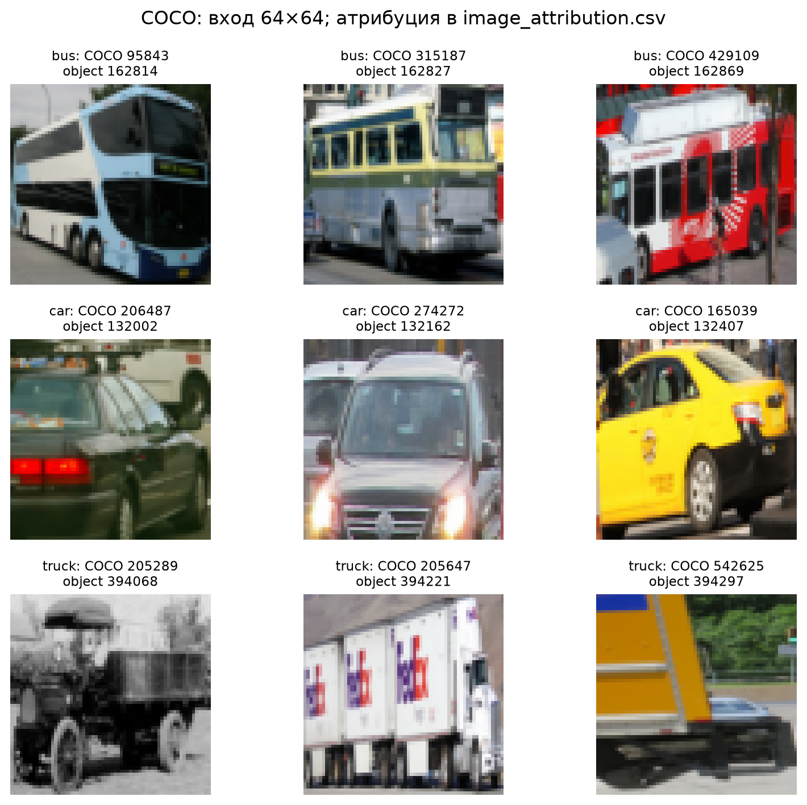
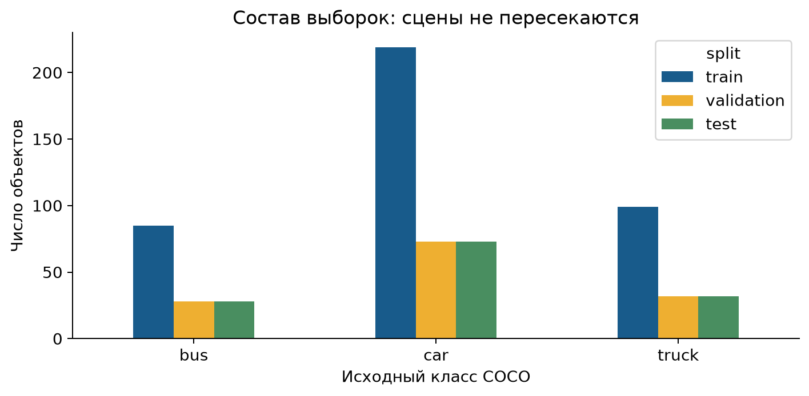
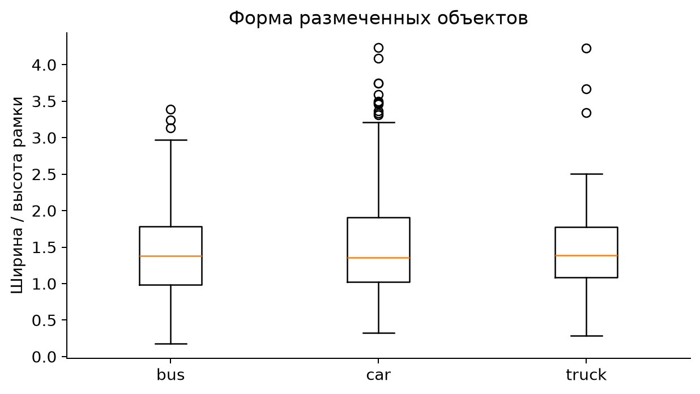
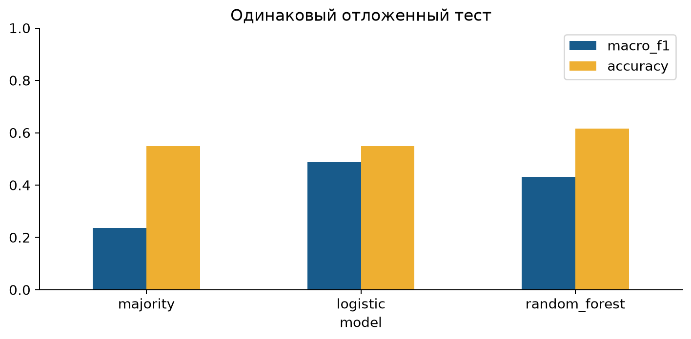
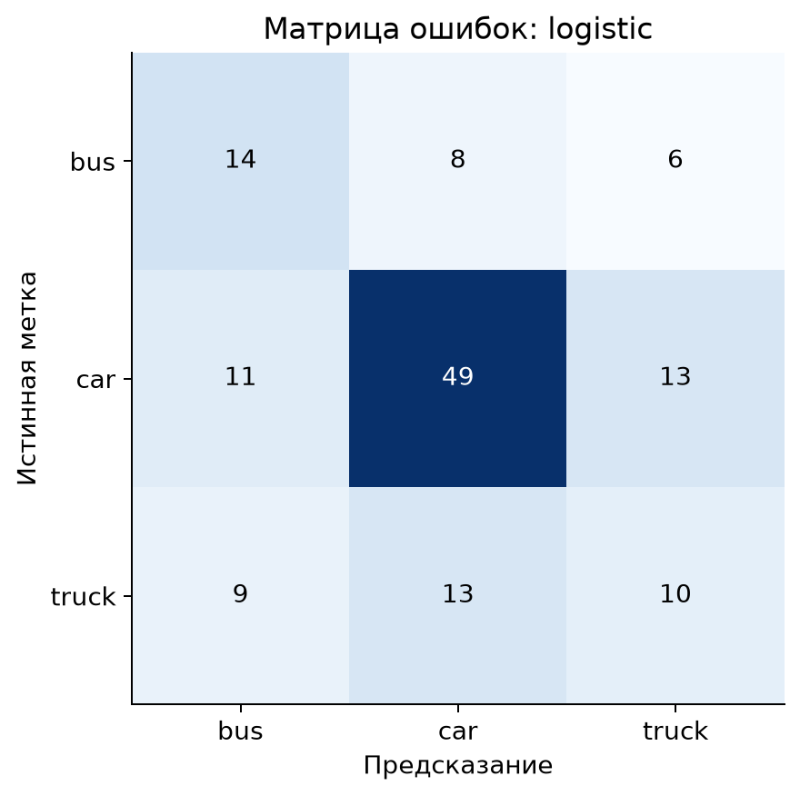
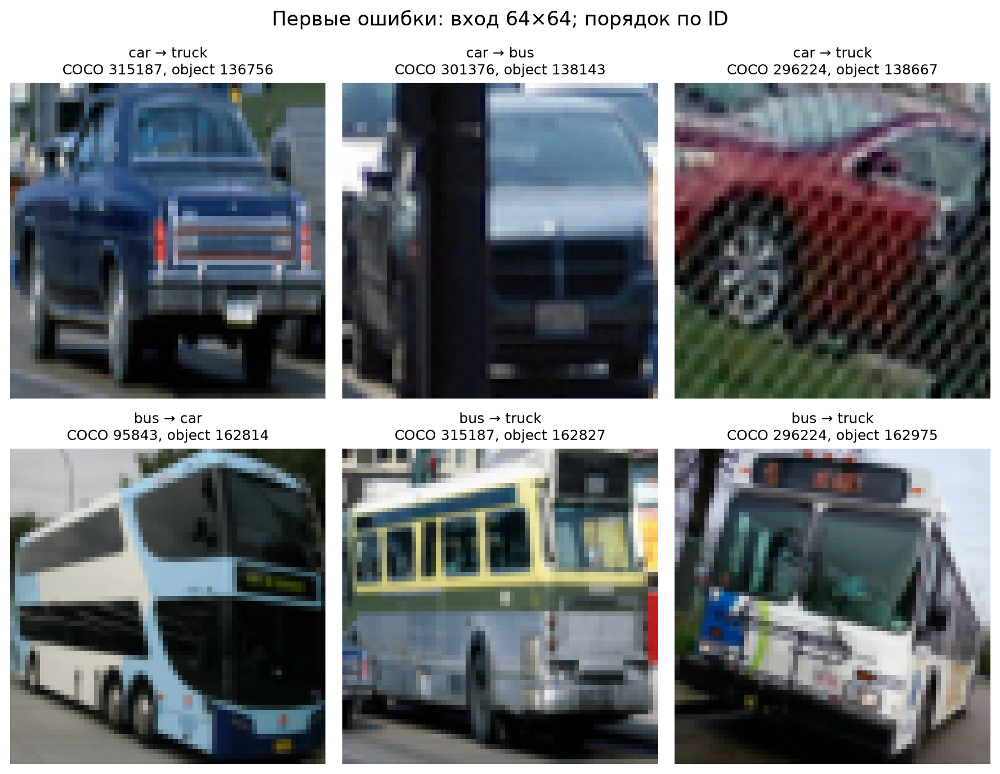
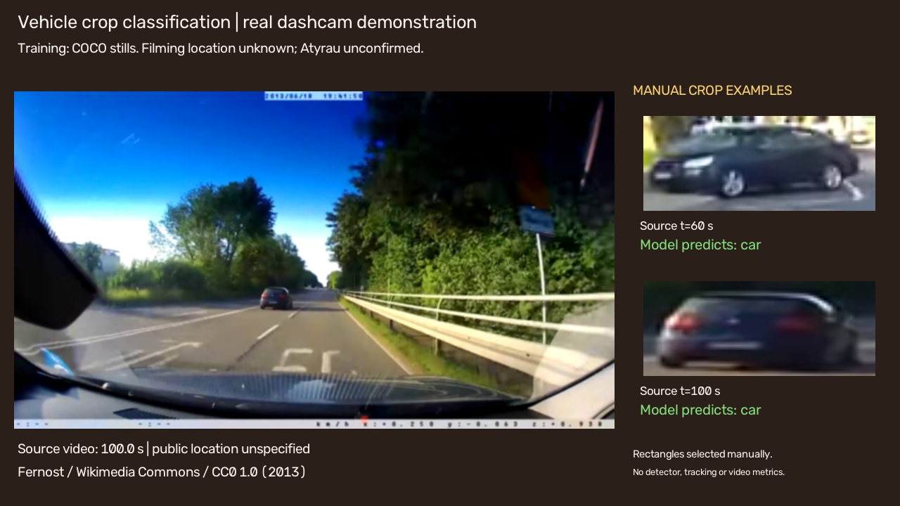

# Классификация автомобилей, автобусов и грузовиков на COCO

## 1. Титульные сведения и аннотация

Курс «Искусственный интеллект и машинное обучение». Assignment 1; исходный кейс №15: Vehicle Type Classification from Dashcam Footage. Редакция от 26 сентября 2026 года. Выполнена классификация объектов на фотографиях COCO и отдельная демонстрация на разрешённом реальном видео. Локальная проверка Атырау отсутствует. Материал подготовлен с раскрываемой помощью ИИ; студенту необходимо проверить расчёты и самостоятельно понимать методику перед защитой. Авторские реквизиты не выдуманы.

Исследование проверяет, позволяет ли небольшая воспроизводимая модель отличать три типа транспорта по размеченным кропам. После фильтрации лицензий, crowd-объектов и рамок меньше 40×40 пикселей получено 669 объектов в 337 фотографиях. Разбиение выполнено по исходным фотографиям: 403 обучающих, 133 валидационных и 133 тестовых объектов. Сравниваются majority baseline, логистическая регрессия и случайный лес. Обучение выполнялось с нуля на HOG, цветовых гистограммах и отношении сторон; предобученных весов нет.

Выбранная по валидационной выборке логистическая модель получила на test macro-F1 = 0.4883; правило «всегда car» — 0.2362. При этом доля верных ответов обеих моделей одинакова: 0.5489. Модель распознаёт часть автобусов и грузовиков, но одновременно ошибается на большем числе легковых автомобилей. Поэтому улучшение macro-F1 не означает роста общей точности или готовности городского сервиса. Видеодемонстрация длится 30 секунд и показывает прогнозы для вручную заданных областей. Количественная оценка Атырау, обнаружение объектов полного кадра и трекинг не выполнялись.

## 2. Введение и исследовательские вопросы

Исходный кейс посвящён классификации типов транспорта с видеорегистратора. Практическая мотивация — раздельный учёт легковых автомобилей, общественного и грузового транспорта. Для Атырау такая система потребовала бы реальных местных поездок, различных дорог, освещения и сезонов, а также проверенной разметки. Эти данные в данном проекте не получены; название поэтому не утверждает эмпирическое исследование транспорта Атырау.

Операционально задача ограничена классификацией уже выделенного объекта. На вход подаётся RGB-кроп по эталонной рамке, на выходе один из классов car,bus,truck. Это закрытая трёхклассовая задача: мотоциклы, велосипеды, фон и неизвестные типы транспорта здесь не распознаются. В реальном видео объект ещё необходимо найти; ошибки этого этапа не включены в основную оценку.

RQ1: превосходит ли обучаемый классификатор правило «всегда car» по macro-F1 на фотографиях, отсутствовавших при обучении? RQ2: какие классы и типы ошибок ограничивают качество? RQ3: что можно и чего нельзя заключить о переносе на dashcam и Атырау? Критерий выбора модели, метрики и схема разделения зафиксированы до fit. Ответы сопоставляются с таблицами results, а не с впечатлением от красивых рамок.

Главный практический риск — принять высокий процент car за хороший многоклассовый классификатор. Поэтому accuracy включена как дополнительная метрика, а не основание выбора. Иначе редкие автобусы и грузовики могут систематически игнорироваться.

## 3. Литература и проверка данных

COCO создавался для распознавания объектов в сложных повседневных сценах и содержит объектную разметку [V03]. Для этой работы используется конкретный выпуск val2017 с доступными JSON и JPEG [V01]. Разнообразие фотографий полезно для методического сравнения, однако не превращает COCO в выборку видеорегистраторов. Отдельная лицензия аннотаций также не заменяет права на каждое изображение [V02].

Работа Dalal и Triggs вводит HOG как описание локальных направлений градиента [V04]. В данном эксперименте HOG используется для формы транспорта; эффективность для этой задачи проверяется собственными метриками, а не переносится из опубликованных результатов обнаружения людей. Линейная классификация делает обучение малозатратным; лес проверяет альтернативную нелинейную границу на тех же признаках.

BDD100K является содержательно более подходящим driving-набором [V05]. Проверенная официальная страница направляет в User portal; документация лицензии не открылась в этой сессии [V06]. Неподтверждённое зеркало с маркировкой BSD не использовано. UA-DETRAC проверен по странице одного из авторов [V07]: имеются ссылки на изображения и аннотации, но явная лицензия распространения на прочитанной странице не установлена. Кроме того, стационарная дорожная съёмка отличается от видеорегистратора.

Эта проверка устанавливает предел выполненной части, а не утверждает отсутствие всех возможных локальных данных в интернете. Найденное CC0-видео Fernost [V08] решает задачу демонстрации; без независимой разметки оно не является тестом accuracy. Выбран прозрачный внешний fallback, прямо разрешённый пользовательским заданием при нехватке локальных данных.

## 4. Данные, лицензии и очистка

Исходный JSON содержит 5000 фотографий и 36781 аннотаций всех категорий. Среди них 2632 аннотаций car,bus,truck. В конечную выборку попали 669 кропов. Остальные 1963 не удовлетворяют хотя бы одному правилу: лицензия допускает выбранное преобразование, crowd=0, обе стороны рамки≥40 пикселей. Причины пересекаются; их нельзя складывать как независимые группы исключения. Случаев неуспешной загрузки выбранных изображений нет.

Таблица 1. Последовательный отбор по исходному JSON. На каждом шаге рассматривается результат предыдущего; поэтому потери между соседними строками не пересекаются.

| Этап | Объекты | Фотографии |
|---|---|---|
| Исходные car, bus, truck | 2632 | 707 |
| Лицензия BY / BY-SA / BY-NC / BY-NC-SA | 1855 | 479 |
| Исключены crowd-объекты | 1842 | 479 |
| Обе стороны рамки не меньше 40 пикселей | 669 | 337 |

Сохранены CC BY, BY-SA, BY-NC и BY-NC-SA2.0; изображения NoDerivatives исключены. Некоммерческий характер учебной работы не отменяет атрибуцию или ShareAlike. У каждой строки есть исходный Flickr URL, COCO URL, license name/url и указание на преобразование. Сведения об авторе и названии, отсутствующие в COCO, отмечены как отсутствующие; имена не выдуманы. Попытка получить Flickr oEmbed завершилась сетевым тайм-аутом. Перед открытой публикацией следует дополнить доступную атрибуцию.

Таблица 2. Условия выбранных фотографий по метаданным COCO. Одна фотография имеет одну лицензию; несколько объектов из неё сохраняют те же условия.

| Лицензия | Фотографии | Объекты |
|---|---|---|
| CC BY-NC-SA 2.0 | 150 | 280 |
| CC BY-NC 2.0 | 64 | 132 |
| CC BY 2.0 | 90 | 192 |
| CC BY-SA 2.0 | 33 | 65 |

Повторный аудит сопоставил каждую метку, рамку, URL и лицензию с исходным JSON; каждый PNG-кроп восстановлен из JPEG и сравнен по пикселям. Совпадение подтверждает правильность подготовки. Оно не заменяет проверку того, что сам автор исходной аннотации правильно определил класс, и не восстанавливает недостающую атрибуцию Flickr.

Кропы сохраняются в RGB PNG исходного размера. При извлечении признаков они приводятся к 64×64. Это меняет пропорции, поэтому исходное отношение ширины и высоты сохранено отдельным признаком. Рамки проверяются по границам изображения. Никаких псевдометок, синтетических автомобилей или копирования строк для увеличения выборки нет. В dataset.csv находится индекс, а не изображения в строках.

География и поездки в метаданных выбранных COCO-фотографий не установлены. date_captured сохранено исключительно для происхождения; часовой пояс и фактическая дата съёмки не подтверждены. Временная сезонность, доля грузовиков в городе и число уникальных автомобилей по этим данным не оцениваются. Manifest и SHA-256 позволяют проверить воспроизведение конкретной выборки.

Рисунок 1. Первые три объекта каждого класса по ID; разрешённые производные COCO-фотографий. Индивидуальные источники и лицензии: results/image_attribution.csv. Показ не отобран по успешности модели.

## 5. EDA и исследовательские ограничения выборки

Таблица 3. Количество объектов по классам и частям. Числа являются целыми количествами, а не весами примеров.

| Выборка | bus | car | truck |
|---|---|---|---|
| train | 85 | 219 | 99 |
| validation | 28 | 73 | 32 |
| test | 28 | 73 | 32 |

Класс car составляет 365/669 объектов (54.6%). Это свойство выбранных фотографий после фильтров, а не оценка транспортного потока какого-либо города. Bus и truck представлены меньшим числом объектов; каждая ошибка сильнее влияет на их Recall. Пропусков обязательных ID, класса, пути и split нет. Это не означает отсутствия ошибочной исходной разметки.

Рисунок 2. Три класса есть во всех частях. Объектные количества не равны числу независимых сцен; test содержит 64 группы.

Рисунок 3. Распределение формы эталонных рамок. Разброс отражает ракурс и частичную видимость наряду с типом объекта. Различие распределений не доказывает, что отношение сторон причинно определяет класс. График рассчитан на фактических аннотациях; количественные описания размеров сохранены в results/eda_box_sizes.csv.

Ограничение минимального размера улучшает читаемость входа, но исключает важные для dashcam дальние автомобили. Дальние объекты в демонстрации могут быть меньше обучающего порога, поэтому перенос особенно сомнителен. Отсутствие погодных и дорожных атрибутов исключает честное заявление о проверке дождя, снега, ночи и локальной инфраструктуры.

## 6. Разбиение и защита от утечки

Минимальная группа — исходная фотография. Все её объекты попадают в одну часть. Дополнительно вычисляются pHash полных изображений и кропов: полные изображения с Hamming distance≤6 объединяются; идентичные pHash кропов также объединяют исходные фотографии. Найдено 0 пар полных изображений по заданному правилу. Это полезная автоматическая проверка, но не универсальное доказательство отсутствия фотографий одной физической сцены.

Использован StratifiedGroupKFold с 5 частями, shuffle=True и seed42: fold0 назначен test,fold1 validation, остальные train. Разделение проводится один раз до обучения. Хотя используется класс KFold, здесь не заявляется результат пятифолдовой оценки: получено одно фиксированное train/validation/test. Размеры групп: train206, validation67, test64.

Основной test не используется для выбора C, глубины деревьев или семейства модели. Scaler обучается только на train. После настройки на validation модель не переобучается на train+validation, что упрощает проверку ровно той модели, которая сравнивалась при выборе. Список классов зафиксирован заранее. Источник COCO называется val2017, однако весь выбранный материал разделён заново; опубликованный результат не сопоставим со стандартным COCO benchmark.

Точных одинаковых PNG между split нет; image_id и scene_group не пересекаются. Предобученные модели отсутствуют, поэтому скрытое пересечение с их pretraining исключается конструкцией эксперимента. Оставшееся ограничение — отсутствие trip/photographer metadata и невозможность доказать независимость всех семантически похожих сцен.

## 7. Методология, модели и метрики

Каждый кроп даёт 1813 признаков:1764 HOG,48 значений RGB-гистограмм и 1 логарифм отношения сторон. HOG использует 9 ориентаций, ячейку 8×8, блок 2×2 и L2-Hys-нормализацию. Гистограмма каждого канала имеет 16 интервалов; значения нормированы числом пикселей. Эта схема повторяется одинаково для всех частей. Признаки не включают ID, лицензию, путь или метку.

Baseline — DummyClassifier most_frequent, обученный на train. Он всегда возвращает car. Простой обучаемый вариант — StandardScaler и LogisticRegression с balanced class weights,max_iter2000; C∈{0.01,0.1,1}. Альтернатива —250 деревьев RandomForestClassifier, balanced_subsample,min_samples_leaf2,max_depth∈{8,None}. Во всех случайных операциях seed42. Получено пять реальных fit; сведения о времени, размере обучения, параметрах и сходимости сохранены в training_history.csv. Это классические классификаторы, а не fine-tuning нейросети.

Для каждого класса Precision=TP/(TP+FP), Recall=TP/(TP+FN), F1=2PR/(P+R). Macro-F1 усредняет три F1 с одинаковыми весами [V09]. Нулевой знаменатель оценивается как 0. Accuracy — доля правильных меток среди всех 133 test объектов. Не рассчитываются mAP, ROC-AUC или число уникальных машин: они не отвечают выполненной задаче и отсутствующей разметке.

По validation выбрана логистическая регрессия C1. Доверительный описательный диапазон рассчитан 500 bootstrap-повторами по целым test scene_group; отдельные коррелированные кропы не ресэмплируются независимо. Он отражает неопределённость в наблюдаемом источнике, не перенос на Атырау и не гарантию качества будущей системы.

## 8. Результаты сравнения моделей

Таблица 4. Одни и те же 133 тестовых объектов для всех моделей. Основная метрика выбора — macro-F1 на validation.

| Модель | Macro-F1: validation | Macro-F1: test | Accuracy: test |
|---|---|---|---|
| Всегда car | 0.2362 | 0.2362 | 0.5489 |
| Логистическая регрессия | 0.5305 | 0.4883 | 0.5489 |
| Случайный лес | 0.3426 | 0.4308 | 0.6165 |

Рисунок 4. Все модели оценены на одних объектах. Выбор выполнен по validation macro-F1, а не по столбцам test.

Ответ на RQ1: выбранная логистическая модель превышает majority macro-F1 на 0.2520 абсолютного пункта, с 0.2362 до 0.4883. Это изменение нельзя трактовать как процент правильно распознанного транспорта в городе. Accuracy остаётся 0.5489, поскольку ошибки перераспределяются между классами. Больший macro-F1 означает, что модель хотя бы частично распознаёт автобус и грузовик, вместо полного отказа от этих классов.

Таблица 5. Число правильных ответов в каждом истинном классе. Эта таблица объясняет расхождение между accuracy и macro-F1 без смены критерия после просмотра test.

| Модель | bus | car | truck | Всего |
|---|---|---|---|---|
| Всегда car | 0 | 73 | 0 | 73 |
| Логистическая регрессия | 14 | 49 | 10 | 73 |
| Случайный лес | 6 | 72 | 4 | 82 |

Правило «всегда car» правильно классифицирует все 73 легковых автомобиля и ни одного автобуса или грузовика. Логистическая модель правильно распознаёт 49 легковых автомобилей, 14 автобусов и 10 грузовиков. Таким образом, 24 новых правильных ответов на двух меньших классах компенсируются ровно таким же числом потерянных ответов на car. Общее число верных решений не меняется; распределение полезности модели по классам меняется существенно.

Лес имеет более высокую test accuracy = 0.6165, но меньший macro-F1 = 0.4308; он не выбран задним числом. Его Recall для bus составляет 21.4%, для truck — 12.5%. Значительная часть преимущества по accuracy связана с почти полным восстановлением car. Валидационный macro-F1 леса также ниже. Поэтому нельзя менять критерий на accuracy после просмотра test, чтобы объявить более успешный результат.

Описательный bootstrap-интервал macro-F1 выбранной модели: [0.3874; 0.5919] при 500 повторных выборках целых групп. Диапазон заметно широк. Это не отдельный статистический тест превосходства над baseline: для такого вывода потребовался бы заранее заданный парный анализ разности метрик. Test раскрыт в исходном исследовании 25 сентября. Редакция 26 сентября повторяет вычисления того же зафиксированного эксперимента и углубляет описание ошибок; новые модели, признаки, пороги, фильтры и гиперпараметры по уже увиденному test не подбирались.

## 9. Ошибки и обсуждение

Таблица 6. Поклассовые метрики выбранной логистической регрессии. Support — целое число объектов истинного класса.

| class | precision | recall | f1-score | support |
|---|---|---|---|---|
| bus | 0.4118 | 0.5000 | 0.4516 | 28 |
| car | 0.7000 | 0.6712 | 0.6853 | 73 |
| truck | 0.3448 | 0.3125 | 0.3279 | 32 |

Рисунок 5. Строки — исходные классы, столбцы — предсказания; counts, а не проценты. Исходная таблица results/confusion_matrix.csv.

Ответ на RQ2: наибольший F1 у car, наименьший у truck. Recall truck=0.3125; значит большинство тестовых грузовиков не распознано как truck. Всего неверных предсказаний 60/133. Слабое качество отдельных классов не позволяет автоматически использовать модель для точного муниципального учёта.

Из 32 грузовиков 13 названы car и 9 — bus. Это 22 пропущенных грузовика, даже при наличии правильной рамки объекта. Обратная ошибка также существенна: среди 29 прогнозов truck только 10 верны; остальные приходятся на 13 легковых автомобилей и 6 автобусов. Модель одновременно недосчитывает реальные грузовики и добавляет ложные. Простое суммирование её ответов поэтому не является надёжной оценкой транспортного потока.

Для bus верны 14 из 28 объектов, но модель выдаёт класс bus 34 раза. Наличие и пропусков, и ложных срабатываний объясняет, почему одного Recall недостаточно. Систематическое объяснение ошибок потребовало бы отдельных проверенных меток ракурса, заслонения и расстояния. В текущей работе такие факторы не размечены, поэтому они обсуждаются как возможные причины, а не как установленные закономерности.

Рисунок 6. Первые шесть ошибок в фиксированном порядке объекта. Это аудит наблюдаемых ошибок, а не доказанный причинный анализ. Крупные рамки, частичная видимость, перспектива и похожая форма могут затруднять классификацию; их вклад отдельно не измерен. Каждая показанная ошибка прослеживается до ID и исходной лицензии.

Обучающий macro-F1 выбранной конфигурации — 0.9976, валидационный — 0.5305, тестовый — 0.4883. При 1813 признаках и 403 обучающих объектах модель почти запоминает train. Разрыв указывает на сильное переобучение; оценка на обучающих данных не подходит для доказательства качества. Проверка масштабирования подтвердила, что средние StandardScaler вычислены именно по train. Это устраняет одну потенциальную техническую утечку, но не решает проблему малого разнообразия данных.

## 10. Видеодемонстрация и границы переноса

Ответ на RQ3: количественное качество переноса на видеорегистратор и Атырау не установлено. demo.mp4 содержит 30 секунд реального CC0-видео Fernost, фрагмент 85–115 секунд. Страница файла указывает 2013 год; точная дата расходится с встроенным таймстампом и не используется в выводах. География не установлена и не подписана как Атырау [V08].

В боковой панели показаны две заранее вручную заданные области из этого же видео с явными исходными таймстампами 60 и 100 секунд. Предсказания вычисляет сохранённая логистическая модель. Это проверка прохождения изображения через классификатор, а не автоматический detector, tracker или эталонная тестовая разметка. Статические кропы в панели не выдаются за покадровые обнаружения на текущем видеокадре.

Рисунок 7. Реальный кадр созданной демонстрации. Источник CC0; разрешение результата 1280×720,15fps,450 декодируемых кадров. Время обработки полного конвейера как benchmark не измерено, термин real-time не применяется. Никакие лица, номера или личности не извлекаются; показ уменьшен и смягчён. Перед публичным распространением требуется самостоятельная визуальная проверка приватности.

Для настоящей локальной проверки нужны независимо снятые и разрешённые поездки Атырау с ручной разметкой классов, отдельными train/validation/test по поездкам и достаточным числом автобусов и грузовиков. Необходимо дополнительно измерить ошибки выделения рамок и долю пропущенных объектов. Неразмеченное красивое видео не заменяет эти требования.

## 11. Рекомендации, воспроизводимость и ограничения

Сначала следует увеличить число независимых дорожных сцен, особенно truck и bus, затем повторить заранее фиксированное сравнение. Полезно сравнить модель на исходных эталонных кропах и на автоматически найденных объектах, чтобы отделить ошибку классификатора от detector. Новый локальный test нужно зарегистрировать до настройки и сохранить целиком; выбирать удачные поездки по результатам нельзя.

Для учебной защиты студент должен объяснить разницу между macro-F1 и accuracy на собственных числах, назначение split по фото, источник переобучения и отсутствие доказанного переноса. Код, подготовка и расчёты выполнялись при помощи ИИ; данная работа не поддерживает утверждение о полностью самостоятельном выполнении без ИИ. Согласование применения внешнего fallback и окончательная академическая оценка остаются за преподавателем.

Последовательность воспроизведения: python scripts/prepare_data.py, затем python scripts/make_notebook.py, python scripts/make_artifacts.py и python scripts/build_slides_v2.py. Notebook сам обучает модели и пересоздаёт демонстрацию до чтения её метаданных. Предварительно сохранённые признаки, веса, разбиение или predictions ему не нужны. Подготовке нужны исходный JSON и фотографии; при отсутствии они загружаются по сохранённым адресам. Для преобразования видео нужен ffmpeg в PATH. Отдельная проверка существующих результатов: python pipeline.py --verify-only. Пути определяются относительно файла скрипта; пробелы в них поддерживаются.

Повторный аудит усилил проверку воспроизводимости: закреплены хеши исходного JSON, фотографий и видео; неожиданное изменение источника или потеря одной фотографии теперь останавливает работу вместо незаметной смены выборки. Эти SHA-256 фиксируют локально полученный исследовательский снимок, а не являются подписью издателя. Проверки заново извлекают признаки из изображений, загружают собственные сохранённые веса, воспроизводят прогнозы и обе основные метрики. Сходимость коэффициентов, гиперпараметры и обученные преобразования сохранены вместе с моделями. Загруженные из сети сериализованные модели не использовались.

Сохранены исходный JSON, выбранные фотографии, кропы, признаки, индекс разбиения, пять конфигураций в истории обучения, модели, SHA-256, прогнозы, матрица ошибок и групповой bootstrap. Технический аудит содержит 23 проверок; отдельный аудит происхождения и подготовки — 15. Их положительный результат означает внутреннюю согласованность работы. Ключевые внешние ограничения остаются: фотографии вместо размеченных поездок, отсутствие местной выборки, неполная атрибуция Flickr, неизвестная независимость физических сцен, исключение мелких объектов, низкая полнота truck и отсутствие оценки детектора.

## 12. Заключение и источники

Получен воспроизводимый скромный результат классификации на реальных данных. Логистическая модель улучшила равновзвешенную по классам F1 относительно majority, но не общую accuracy; слабый Recall грузовиков и переобучение исключают заявление о готовой городской системе. Все выводы ограничены подготовленным набором COCO. Видео подтверждает работу процедуры применения модели к вручную заданному кропу. Часть исходного кейса, требующая количественного исследования видеорегистратора Атырау, остаётся PARTIAL.

- [V01] COCO Consortium. **COCO 2017 instance annotations and image downloads**. COCO 2017 release. http://images.cocodataset.org/annotations/annotations_trainval2017.zip (дата обращения: 25.09.2026).
- [V02] COCO Consortium. **COCO Terms of Use**. Accessed2026. https://github.com/cocodataset/cocodataset.github.io/blob/master/dataset/termsofuse.htm (дата обращения: 25.09.2026).
- [V03] Tsung-Yi Lin et al.. **Microsoft COCO: Common Objects in Context**. 2014/2015. https://arxiv.org/abs/1405.0312 (дата обращения: 25.09.2026).
- [V04] Navneet Dalal and Bill Triggs. **Histograms of Oriented Gradients for Human Detection**. 2005. https://lear.inrialpes.fr/people/triggs/pubs/Dalal-cvpr05.pdf (дата обращения: 25.09.2026).
- [V05] Fisher Yu et al.. **BDD100K: A Diverse Driving Dataset for Heterogeneous Multitask Learning**. 2020. https://openaccess.thecvf.com/content_CVPR_2020/papers/Yu_BDD100K_A_Diverse_Driving_Dataset_for_Heterogeneous_Multitask_Learning_CVPR_2020_paper.pdf (дата обращения: 25.09.2026).
- [V06] Berkeley DeepDrive. **BDD100K official download portal**. Accessed2026. https://bdd-data.berkeley.edu/ (дата обращения: 25.09.2026).
- [V07] Dawei Du et al.. **UA-DETRAC project**. 2020 reference. https://sites.google.com/view/daweidu/projects/ua-detrac (дата обращения: 25.09.2026).
- [V08] Fernost. **Dashcam Recording (urban).ogv**. 2013. https://commons.wikimedia.org/wiki/File:Dashcam_Recording_(urban).ogv (дата обращения: 25.09.2026).
- [V09] scikit-learn contributors. **f1_score documentation**. Accessed2026. https://scikit-learn.org/stable/modules/generated/sklearn.metrics.f1_score.html (дата обращения: 25.09.2026).
- [V10] Creative Commons. **Creative Commons BY 2.0**. 2.0. https://creativecommons.org/licenses/by/2.0/ (дата обращения: 25.09.2026).
- [V11] Creative Commons. **Creative Commons BY-SA 2.0**. 2.0. https://creativecommons.org/licenses/by-sa/2.0/ (дата обращения: 25.09.2026).
- [V12] Creative Commons. **Creative Commons BY-NC 2.0**. 2.0. https://creativecommons.org/licenses/by-nc/2.0/ (дата обращения: 25.09.2026).
- [V13] Creative Commons. **Creative Commons BY-NC-SA 2.0**. 2.0. https://creativecommons.org/licenses/by-nc-sa/2.0/ (дата обращения: 25.09.2026).
